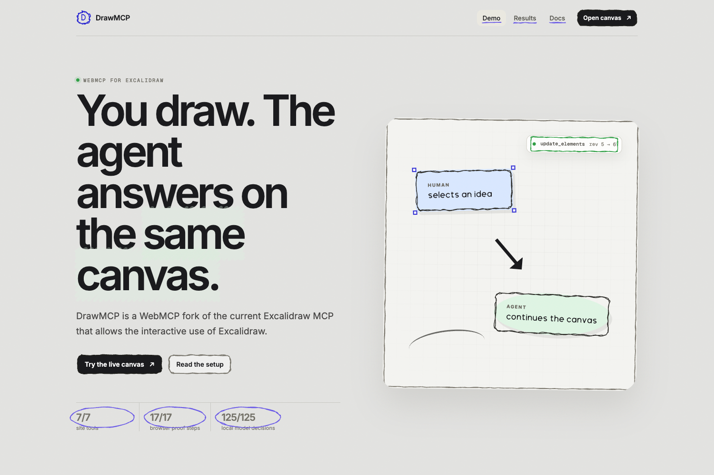
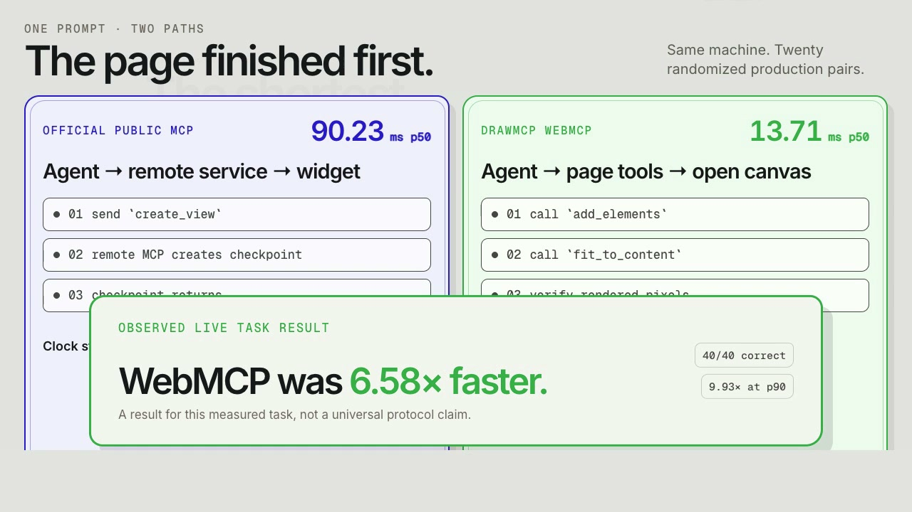
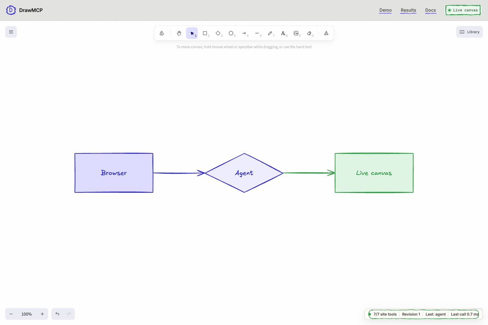
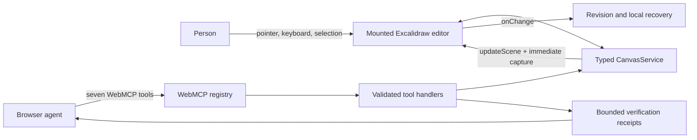
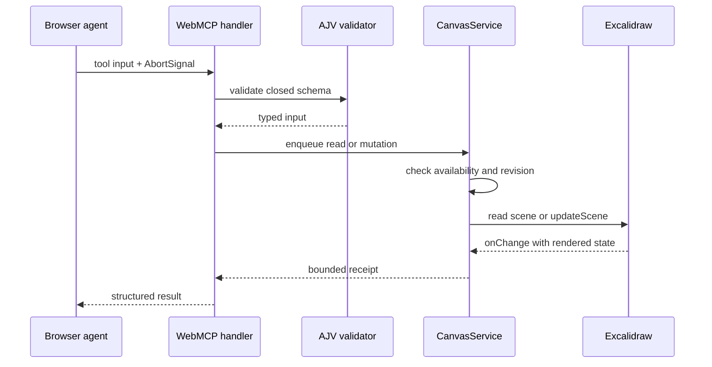

# DrawMCP

<!-- markdownlint-disable MD013 -->

DrawMCP is a WebMCP version of the current Excalidraw MCP. It lets a browser
agent work on the same live Excalidraw canvas a person already has open, while
the person keeps the normal editor, shortcuts, selection, history, and control.
In our measured production-task evaluation, DrawMCP reached a 6.58x median
speedup.

[Open DrawMCP](https://drawmcp.dev) ·
[Try the canvas](https://drawmcp.dev/canvas) ·
[Read the docs](https://drawmcp.dev/docs) ·
[Inspect the benchmarks](https://drawmcp.dev/benchmarks)



## Key features

- Seven small, typed tools over the currently mounted Excalidraw canvas
- Human and agent edits on one shared scene, with no export/import handoff
- Normal Excalidraw keyboard, pointer, selection, and editing behavior
- Closed JSON Schemas, generated AJV validators, and bounded tool results
- Revision-aware writes that reject stale agent mutations
- One undoable Excalidraw history entry per accepted mutation
- Local scene recovery without a database, account, or server
- Tool execution timing in the browser Performance panel
- Deterministic, probabilistic, visual, security, continuity, and benchmark tests
- Static Vite deployment with restrictive production headers on Vercel

## Current proof

The repository carries the evidence behind the public claims instead of relying
on screenshots alone.

| Check | Accepted result |
| --- | ---: |
| WebMCP tools registered | 7/7 |
| Unit and component tests | 116/116 |
| Deterministic browser assertions | 17/17 |
| Production CSP assertions | 17/17 |
| Chrome Labs authored smoke calls | 11/11 |
| Shared-canvas continuity scenarios | 1/1 |
| Responsive visual routes | 9/9 |
| Repeated local-model decisions | 125/125 |
| Controlled semantic benchmark trials | 220/220 |
| Live semantic benchmark trials | 40/40 |

In the accepted live observation, 20 seeded, randomized production pairs
completed with no semantic failures. DrawMCP completed `add_elements`,
`fit_to_content`, and a rendered canvas change in **13.71 ms p50**. The official
public MCP returned its pre-widget `create_view` checkpoint in **90.23 ms p50**.
That is a task-specific **6.58x median speedup** for this deployment and scenario.
It is not a universal protocol ranking. The two boundaries are stated beside
every published result.



## Table of contents

- [What DrawMCP is](#what-drawmcp-is)
- [How it differs from the official MCP](#how-it-differs-from-the-official-mcp)
- [Try it](#try-it)
- [Tech stack](#tech-stack)
- [Prerequisites](#prerequisites)
- [Getting started](#getting-started)
- [Application routes](#application-routes)
- [WebMCP tool reference](#webmcp-tool-reference)
- [Architecture](#architecture)
- [State, history, and persistence](#state-history-and-persistence)
- [Security model](#security-model)
- [Observability](#observability)
- [Testing and evaluation](#testing-and-evaluation)
- [Benchmark methodology](#benchmark-methodology)
- [Available scripts](#available-scripts)
- [Environment variables](#environment-variables)
- [Production deployment](#production-deployment)
- [Release process](#release-process)
- [Troubleshooting](#troubleshooting)
- [Repository map](#repository-map)
- [Contributing](#contributing)
- [Upstream projects and attribution](#upstream-projects-and-attribution)
- [License](#license)

## What DrawMCP is

Excalidraw has a capable hosted MCP server. Its primary model-visible tool
creates a separate MCP App view. DrawMCP explores a different boundary: the
website itself registers tools for the canvas already on screen.

The intended loop is simple:

1. A person draws or selects something with the normal Excalidraw UI.
2. A browser agent reads that exact scene through WebMCP.
3. The agent adds, changes, removes, focuses, or arranges elements.
4. The person can immediately edit or undo the result.
5. The agent reads the new revision and continues on the same canvas.

The canvas remains a normal, useful Excalidraw editor when WebMCP is absent.
WebMCP support is progressively detected after the editor mounts.



## How it differs from the official MCP

Both approaches are valid. They expose different product and transport
boundaries.

| | Official Excalidraw MCP | DrawMCP WebMCP |
| --- | --- | --- |
| Tool owner | Hosted MCP service | The open web page |
| Primary model-visible write | `create_view` | `add_elements` / `update_elements` |
| Result surface | MCP App widget, then editor handoff | Current mounted canvas |
| Human and agent state | Bridged through a checkpoint | Shared page-owned scene |
| Installation | Configure/connect the MCP server | Open the WebMCP-enabled page |
| History | Checkpoint and widget workflow | Native Excalidraw undo/redo |
| Model-visible tool count | 2 in the audited public surface | 7 page tools |

The full upstream surface accounting is in
[`evals/excalidraw-mcp-surface-map.md`](evals/excalidraw-mcp-surface-map.md).

## Try it

### In ChatGPT

1. Open [drawmcp.dev/canvas](https://drawmcp.dev/canvas) in ChatGPT's in-app
   browser.
2. Wait for the status chip to report `7/7 site tools`.
3. Draw something, select an element, or begin with an empty canvas.
4. Ask the agent to inspect or change the drawing.

Example prompts:

```text
Read the canvas, add three labeled boxes for Browser, Agent, and Canvas,
connect them left to right with arrows, then fit the view.
```

```text
Read my current selection. Change the selected shapes to blue without moving
anything, then fit the selection.
```

```text
Read the whole canvas and arrange the supported nodes horizontally. Keep every
label and connector intact.
```

### In Google Chrome

WebMCP is experimental. In a compatible Chrome build:

1. Open `chrome://flags/#enable-webmcp-testing`.
2. Enable **WebMCP for testing**.
3. Relaunch Chrome.
4. Open the local or deployed `/canvas` route.

See the dated source snapshots in [`research/snapshots/`](research/snapshots/)
for the exact specification and browser guidance used during implementation.

## Tech stack

| Layer | Technology |
| --- | --- |
| Language | TypeScript 6 |
| UI | React 18 |
| Build and local server | Vite 8 |
| Canvas | `@excalidraw/excalidraw` 0.18.1 |
| Tool transport | Experimental WebMCP `document.modelContext` API |
| Schema validation | JSON Schema plus AJV 8 standalone validators |
| Unit/component testing | Vitest, Testing Library, jsdom |
| Browser testing | Chrome, Puppeteer-based runners, `webmcp-evals` |
| Comparison media | HyperFrames source project and generated MP4/posters |
| Hosting | Vercel static deployment |
| CI | GitHub Actions on Node.js 22 |

There is no application backend, database, authentication service, analytics
SDK, or runtime secret. Excalidraw remains the editor, and HyperFrames only
produces the comparison media.

## Prerequisites

Install these before cloning:

- [Git](https://git-scm.com/)
- [Node.js](https://nodejs.org/) 22 or newer
- npm 10 or newer, included with Node.js
- Google Chrome for the real WebMCP browser runners
- `pnpm` only if you plan to rebuild the vendored official MCP benchmark lane

The accepted development environment used Node `v22.23.1`, npm `10.9.8`, and
Chrome `152.0.7977.65`. CI intentionally uses Node.js 22.

## Getting started

### 1. Clone the repository

Clone the two pinned upstream research repositories at the same time:

```bash
git clone --recurse-submodules https://github.com/MoizIbnYousaf/drawmcp.git
cd drawmcp
```

If you already cloned without submodules:

```bash
git submodule update --init --recursive
```

The application itself installs Excalidraw from npm. The submodules are only
used for source-backed research, parity checks, and the official MCP benchmark
lane.

### 2. Install dependencies

Use the committed lockfile for a reproducible install:

```bash
npm ci
```

### 3. Start the development server

```bash
npm run dev
```

Vite prints the local URL, normally
[http://localhost:5173](http://localhost:5173). Open
[http://localhost:5173/canvas](http://localhost:5173/canvas) for the tool-owning
page.

### 4. Confirm the ordinary editor path

Even in a browser without WebMCP, the canvas should load and support normal
Excalidraw interactions. Draw, select, move, delete, undo, redo, zoom, and use
keyboard shortcuts before testing the agent path.

### 5. Run the fast local checks

```bash
npm run lint
npm test
npm run evals:check
npm run build
```

### 6. Run a real browser proof

The deterministic runner starts its own isolated Vite server and compatible
Chrome process:

```bash
npm run evals:deterministic
```

For the Chrome Labs authored smoke runner, keep `npm run dev` running in one
terminal and execute this in another:

```bash
npm run evals:smoke:local
```

## Application routes

| Route | Purpose | Registers tools |
| --- | --- | ---: |
| `/` | Product explanation, side-by-side comparison, and accepted result | No |
| `/canvas` | Live Excalidraw editor and WebMCP owner | Yes, 7 |
| `/benchmarks` | Method, boundaries, result, and checksummed raw data | No |
| `/docs` | Setup, tool, architecture, security, and deployment guide | No |

Vercel rewrites unknown paths to `index.html`; the client router selects the
page from `window.location.pathname`.

## WebMCP tool reference

Only `/canvas` registers tools. Every input schema is closed with
`additionalProperties: false`, and production inputs are checked by generated
AJV validators before a handler runs.

| Tool | Kind | Purpose | Important inputs |
| --- | --- | --- | --- |
| `get_canvas_summary` | Read | Paginate compact live elements, counts, selection count, and revision | `cursor?`, `limit?` |
| `get_selection` | Read | Paginate the person's current selection and revision | `cursor?`, `limit?` |
| `add_elements` | Write | Add validated skeleton elements as one undoable action | `elements`, `expected_revision?` |
| `update_elements` | Write | Patch known live element IDs as one undoable action | `patches`, `expected_revision?` |
| `delete_elements` | Write | Delete known IDs as one undoable action | `ids`, `expected_revision?` |
| `fit_to_content` | View write | Move the viewport to the selection or all content | `scope`, `animate?` |
| `organize_diagram` | Write | Arrange supported nodes using a deterministic local layout | `scope`, `layout`, `spacing?`, `expected_revision?` |

The two read tools carry `readOnlyHint: true`. Results containing human-authored
canvas text are marked as untrusted content. Mutation tools never accept raw
JavaScript, selectors, URLs, file paths, arbitrary DOM operations, or generic
object properties.

### Supported element input

Agent-authored skeletons may be:

- `rectangle`
- `ellipse`
- `diamond`
- `text`
- `arrow`
- `line`

Shapes require `id`, `type`, `x`, `y`, `width`, and `height`. Text requires
`id`, `type`, `x`, `y`, and `text`. Linear elements require `id`, `type`, `x`,
`y`, and at least two points. Arrows and lines may bind to supported nodes by
stable ID.

Example `add_elements` input:

```json
{
  "expected_revision": 3,
  "elements": [
    {
      "id": "browser",
      "type": "rectangle",
      "x": 100,
      "y": 100,
      "width": 220,
      "height": 100,
      "label": { "text": "Browser" },
      "strokeColor": "#1e1e1e",
      "backgroundColor": "#e7f5ff"
    }
  ]
}
```

### Contract limits

| Limit | Value |
| --- | ---: |
| Maximum compact elements returned in one page | 8 |
| Maximum summary elements considered | 200 |
| Maximum selected elements considered | 100 |
| Elements per add | 50 |
| Patches per update | 100 |
| IDs per delete | 100 |
| Text length | 2,000 characters |
| Projected text in a compact read | 120 characters |
| Element ID length | 128 characters |
| Coordinate magnitude | 1,000,000 |
| Element dimension | 100,000 |
| Organize spacing | 20 to 500 |
| Serialized tool result | 1,536 characters |

Read cursors are revision-bound. An agent must use only the `next_cursor`
returned by the preceding page. A mutation based on a read should pass that
read's `revision` as `expected_revision`. If a person changes the scene first,
the stale write is rejected with the current revision and recovery guidance.

## Architecture

### System overview



The mounted Excalidraw editor is the single source of truth. Human changes and
agent changes meet in `CanvasService`; there is no mirrored server scene.

### Registration lifecycle

1. React mounts the Excalidraw editor.
2. Excalidraw supplies its public imperative API.
3. The first editor change marks the canvas ready.
4. `WebMcpRegistry` polls briefly for `document.modelContext`.
5. The page registers all seven tools with one `AbortController`.
6. A route unmount or registry restart aborts and disposes registrations.
7. If the API never appears, the status becomes `unsupported` and the editor
   continues working.

### Tool call lifecycle



Mutations are serialized. The service checks cancellation before committing,
uses the public Excalidraw API, waits for the editor to settle, verifies the
observable result, and returns revision-before/revision-after information.

### Excalidraw API boundary

Production code stays on the published `@excalidraw/excalidraw` 0.18.1 API:

- `excalidrawAPI`
- `getSceneElements`
- `getSceneElementsIncludingDeleted`
- `getAppState`
- `getFiles`
- `convertToExcalidrawElements`
- `updateScene`
- `scrollToContent`
- `onChange`
- `CaptureUpdateAction.IMMEDIATELY`

DrawMCP does not import private editor state or maintain an Excalidraw source
fork. The full API audit is in
[`research/EXCALIDRAW_ARCHITECTURE.md`](research/EXCALIDRAW_ARCHITECTURE.md).

## State, history, and persistence

### Scene revisions

The revision controller observes every accepted human or agent mutation.
Reads return the current revision. Revision guards give agents an optimistic
concurrency contract without locking the person out of the canvas.

### Undo and redo

Agent writes call `updateScene` with `CaptureUpdateAction.IMMEDIATELY`, so each
accepted call enters Excalidraw's normal history. Deleted elements stay in the
editor's history representation instead of being spliced out of state.

### Local recovery

The canvas saves a projected scene to `localStorage` under
`drawmcp:scene:v1`, debounced by 500 ms.

- Up to 5,000 non-file live elements
- Up to 1,000,000 serialized characters
- Scroll position and zoom only from app state
- No images, file payloads, accounts, cloud sync, or server persistence
- Invalid or oversized stored scenes are ignored safely
- An empty live scene clears the recovery entry

Local recovery does not restore Excalidraw's undo history. It exists to recover
the current non-file scene after a reload.

## Security model

DrawMCP treats both agent input and human-authored canvas text as untrusted.

- Closed schemas reject unknown properties.
- IDs, strings, arrays, coordinates, dimensions, colors, and spacing are
  bounded.
- Inputs are validated before dispatch and again at the canvas-service boundary.
- Read results are paginated, projected, and capped.
- Mutation receipts include only bounded IDs and concise summaries.
- Stale revisions are rejected instead of silently overwriting human work.
- Cancellation is checked before an expensive operation commits.
- Tools can only mutate local canvas state and viewport state.
- No tool can navigate, upload, share, execute code, access files, or call an
  arbitrary URL.
- The canvas works without WebMCP, so failure of the agent surface does not
  disable the human editor.

Vercel applies these response headers:

- A restrictive Content Security Policy
- `Permissions-Policy: tools=(self)`
- `Referrer-Policy: no-referrer`
- `X-Content-Type-Options: nosniff`
- `frame-ancestors` limited to DrawMCP and ChatGPT origins

The exact policy is versioned in [`vercel.json`](vercel.json) and covered by
[`src/security/headers.test.ts`](src/security/headers.test.ts).

## Observability

Every tool call records a bounded in-memory metric with:

- tool name
- start time
- duration
- success or failure

The latest metric appears in the canvas status UI. The app also emits a
`PerformanceMeasure` named `drawmcp:<tool_name>` with a `DrawMCP` track group,
so calls can be inspected in Chrome DevTools' Performance panel. Metrics retain
only the latest 200 entries and do not leave the browser.

## Testing and evaluation

### Unit and component tests

```bash
npm test
```

The Vitest suite covers schema rejection, tool handlers, registration disposal,
canvas mutations, revisions, element projection, layout, local recovery,
metrics, headers, release data, routes, and components.

Run one file or watch while developing:

```bash
npx vitest run src/excalidraw/canvas-service.test.ts
npm run test:watch
```

### Contract generation

`src/webmcp/tool-contracts.ts` is the source of truth. Exported fixtures and
standalone validators must match it:

```bash
npm run evals:export
npm run evals:check
```

`evals:check` fails if generation changes tracked files.

### Deterministic browser proof

```bash
npm run evals:deterministic
npm run evals:continuity
npm run evals:visual
npm run evals:csp
```

These runners cover discovery, calls through Chrome's real WebMCP API, semantic
scene oracles, ordinary UI-to-agent continuity, undo/redo, responsive routes,
and the production security policy.

### Chrome Labs smoke suite

```bash
# Terminal 1
npm run dev

# Terminal 2
npm run evals:smoke:local
```

This proves WebMCP discovery and authored calls through `webmcp-evals`. It does
not replace the project-owned semantic runner because the upstream smoke tool
does not interpret every domain-level `{ "ok": false }` receipt as a failed
operation.

### Probabilistic tool-selection evaluation

```bash
npm run evals:schema
npm run evals:probabilistic
```

The corpus covers direct requests, ambiguous requests, stale-state recovery,
and cases where no tool should be called. The default runner uses a named local
Ollama model. No model result is accepted automatically.

To accept a passing, sanitized run:

```bash
npm run evals:accept -- .evals/model/<run>/summary.json
```

Accepted model evidence lives under [`evidence/evals/`](evidence/evals/).

### Production checks

```bash
npm run evals:smoke:production
npm run evals:deterministic:production
npm run evals:continuity:production
npm run evals:visual:production
```

Production checks are separate from local checks. A green local build does not
prove the deployed revision, headers, browser surface, or rendered behavior.

## Benchmark methodology

DrawMCP maintains two benchmark strata.

### Live production task

The accepted public result uses 20 seeded randomized AB/BA pairs and a 500 ms
throttle between calls to the public service.

| Lane | Timed boundary |
| --- | --- |
| DrawMCP WebMCP | Production `add_elements` plus `fit_to_content`, including proof that canvas pixels changed before return |
| Official MCP | Public Streamable HTTP `create_view` through checkpoint response, before widget rendering |

Both lanes are judged by the same semantic graph oracle. Raw trials retain
failures in the denominator and record commits, order, seed, browser, Node,
operating system, duration, byte counts, and oracle result. The report uses
2,000-resample percentile bootstrap intervals and withholds p95 below 40
successful trials per lane.

Verify the accepted live artifact:

```bash
npm run benchmark:verify:live
```

Run a new observation without publishing it:

```bash
npm run benchmark:live
```

### Controlled component benchmark

The controlled runner builds the pinned official MCP submodule and executes 100
randomized warm pairs plus 10 cold pairs per lane.

```bash
npm install --global pnpm
npm run benchmark:run
```

The controlled result explains component cost. It is not an end-to-end
protocol winner because the official lane stops at checkpoint completion while
the DrawMCP lane includes a mounted editor update and two page tools.

Read [`evals/BENCHMARK.md`](evals/BENCHMARK.md) before interpreting or publishing
any number. Checksummed accepted artifacts are under
[`public/benchmarks/`](public/benchmarks/).

## Available scripts

### Development and quality

| Command | Description |
| --- | --- |
| `npm run dev` | Start the Vite development server |
| `npm run build` | Type-check project references and build `dist/` |
| `npm run preview` | Serve the production build locally |
| `npm run lint` | Run Oxlint across application, eval, benchmark, and release code |
| `npm test` | Run all Vitest tests once |
| `npm run test:watch` | Run Vitest in watch mode |

### WebMCP evaluations

| Command | Description |
| --- | --- |
| `npm run evals:export` | Generate public tool fixtures and standalone validators |
| `npm run evals:check` | Regenerate and fail on tracked schema drift |
| `npm run evals:smoke:local` | Run Chrome Labs cases against an already running local page |
| `npm run evals:smoke` | Start an isolated local app and run the authored smoke suite |
| `npm run evals:smoke:production` | Run smoke calls against `drawmcp.dev` |
| `npm run evals:deterministic` | Run project-owned deterministic local browser proof |
| `npm run evals:deterministic:production` | Run the same proof against production |
| `npm run evals:csp` | Test the built app under the production CSP |
| `npm run evals:visual` | Check responsive local routes and runtime errors |
| `npm run evals:visual:production` | Check responsive production routes |
| `npm run evals:continuity` | Prove human edit, agent read/write, render, undo, and redo locally |
| `npm run evals:continuity:production` | Run the continuity proof on production |
| `npm run evals:schema` | Export the model-runner schema |
| `npm run evals:probabilistic` | Run repeated local-model tool-selection cases |
| `npm run evals:accept -- <summary>` | Accept only a passing sanitized model run |

### Benchmarks

| Command | Description |
| --- | --- |
| `npm run benchmark:prepare` | Install and build the pinned official MCP submodule with pnpm |
| `npm run benchmark:run` | Run the full controlled paired benchmark |
| `npm run benchmark:live` | Run the live production observation |
| `npm run benchmark:verify -- <raw>` | Verify controlled counts, schemas, semantics, and statistics |
| `npm run benchmark:accept -- <raw>` | Accept a verified clean-tree controlled artifact |
| `npm run benchmark:verify:live` | Verify the tracked accepted live artifact |
| `npm run benchmark:accept:live -- <raw>` | Accept a valid clean-deployment live artifact |

### Release and media

| Command | Description |
| --- | --- |
| `npm run release:manifest` | Create a checksummed release evidence manifest |
| `npm run release:validate` | Run the complete local release gate and verify clean build metadata |
| `npm run copy:extract` | Export a canonical public-copy payload for review |
| `npm run video:check` | Lint and inspect the comparison video project |

## Environment variables

### Application runtime

**None.** DrawMCP's deployed application is a static client. It does not need a
database URL, API key, OAuth secret, session secret, or server process.

Do not add secrets to `VITE_*` variables. Vite embeds those values into public
client assets.

### Build metadata supplied by Vercel

The build reads these platform-provided values when available:

| Variable | Purpose | Required locally |
| --- | --- | ---: |
| `VERCEL_GIT_COMMIT_SHA` | Records the exact deployed source revision | No |
| `VERCEL_ENV` | Records whether the build is production, preview, or development | No |

Locally, the build uses `git rev-parse HEAD`, checks whether the source tree is
clean, and records `local` as the environment. The generated public metadata is
available at `/release.json`.

## Production deployment

### Vercel Git integration

1. Import the GitHub repository into Vercel.
2. Keep the framework preset as **Vite**.
3. Use `npm run build` as the build command.
4. Use `dist` as the output directory.
5. Do not configure runtime environment variables.
6. Attach the production domain.
7. Confirm that the deployed commit in `/release.json` matches the intended Git
   commit.

`vercel.json` supplies the SPA rewrite and production security headers. No
Render service, persistent server, or authentication setup is required.

### Vercel CLI

For a preview deployment:

```bash
npx vercel
```

For an intentional production deployment:

```bash
npx vercel --prod
```

A deployment finishing successfully proves only that Vercel built and served
an artifact. Run the production browser checks before calling the release
verified.

## Release process

DrawMCP keeps source, build, deployment, and browser proof as separate gates.

1. Begin from a clean candidate commit.
2. Run the complete local gate:

   ```bash
   npm run release:validate
   ```

3. Inspect the new release evidence under `evidence/releases/<commit>/` and
   `public/evidence/latest.json`.
4. Commit only the reviewed source and evidence.
5. Push the intended commit and let Vercel build that revision.
6. Check the deployed `/release.json` source commit.
7. Run the production smoke, deterministic, continuity, and visual suites.
8. Record deployment proof separately from the local manifest.

`release:validate` runs unit tests, lint, schema drift detection, deterministic
browser proof, Chrome Labs smoke, continuity, visual QA, accepted benchmark
verification, media checks, build, public-copy extraction, CSP checks, build
metadata verification, and a high-severity production dependency audit.

## Troubleshooting

### The canvas says WebMCP is unsupported

- Confirm you opened `/canvas`, not `/`, `/docs`, or `/benchmarks`.
- In Chrome, enable `chrome://flags/#enable-webmcp-testing` and relaunch.
- In ChatGPT, use the in-app browser.
- Wait for Excalidraw to finish mounting; registration starts after the canvas
  becomes ready.
- Inspect the console for a registration error.

The editor should still work normally in this state.

### The tool count does not reach 7/7

Reload once after confirming the browser supports `document.modelContext`.
If it remains partial, run:

```bash
npm run evals:deterministic
```

This distinguishes a browser integration problem from an application contract
problem.

### A write returns a stale revision error

A person or another tool changed the scene after the agent read it. Read the
canvas again, use the new revision, recompute the intended change, and retry.
Do not remove `expected_revision` just to bypass the conflict.

### Generated validators or tool fixtures changed

Run:

```bash
npm run evals:export
git diff -- evals/tools.json src/webmcp/generated-validators.ts
```

Review and commit the generated changes with the contract change.

### The official benchmark lane will not build

Confirm submodules and pnpm:

```bash
git submodule update --init --recursive
corepack enable
pnpm --version
npm run benchmark:prepare
```

Never patch files inside `vendor/excalidraw` or `vendor/excalidraw-mcp` to make a
benchmark pass. Update a pin intentionally and record the provenance instead.

### Excalidraw fonts are missing in the production build

Run `npm ci` before `npm run build`. The Vite close hook copies the installed
Excalidraw production fonts from `node_modules` into `dist/fonts`.

### A deployed page is not the commit you expected

Open:

```text
https://drawmcp.dev/release.json
```

Compare `source_commit` with:

```bash
git rev-parse HEAD
```

Also verify `source_tree_clean`, `release_manifest_source_commit`, and the
manifest checksum before treating the deployment as current.

### Video does not autoplay

The homepage videos are muted, inline, and paired with poster images. Browser
autoplay policies or reduced-motion preferences may still show the poster. The
comparison remains understandable without motion.

## Repository map

```text
.
├── src/
│   ├── components/             Excalidraw mount, status, and site components
│   ├── data/                   Parsed public release and benchmark evidence
│   ├── excalidraw/             CanvasService, revisions, projection, recovery
│   ├── layout/                 Deterministic diagram arrangement
│   ├── observability/          Browser-local tool metrics
│   ├── pages/                  Home, canvas, docs, and benchmark routes
│   ├── security/               Header assertions
│   └── webmcp/                 Contracts, validators, handlers, registration
├── evals/                      Tool fixtures, corpora, oracles, benchmark spec
├── benchmarks/                 Shared scenarios and benchmark support
├── scripts/
│   ├── benchmarks/             Run, verify, and accept benchmark evidence
│   ├── evals/                  Browser and model evaluation runners
│   └── release/                Manifest, validation, and copy tooling
├── public/
│   ├── benchmarks/             Checksummed accepted benchmark artifacts
│   ├── evidence/               Latest public release manifest
│   └── videos/                 Web-ready comparison loops and posters
├── evidence/                   Accepted release and model-run evidence
├── docs/                       Product, implementation, proof, and submission docs
├── research/                   Source-backed WebMCP and upstream audits
├── video/comparison/           HyperFrames comparison-video source
├── vendor/excalidraw/          Pinned read-only Excalidraw submodule
├── vendor/excalidraw-mcp/      Pinned read-only Excalidraw MCP submodule
├── vercel.json                 SPA routing and production security headers
└── vite.config.ts              Build, fonts, and release metadata
```

### Authoritative project documents

1. [Approach](docs/APPROACH.md)
2. [Implementation plan](docs/IMPLEMENTATION_PLAN.md)
3. [WebMCP guidelines](docs/WEBMCP_GUIDELINES.md)
4. [Proof plan](docs/PROOF_PLAN.md)
5. [Benchmark protocol](evals/BENCHMARK.md)
6. [Upstream contribution strategy](docs/UPSTREAM_CONTRIBUTION.md)
7. [Excalidraw architecture audit](research/EXCALIDRAW_ARCHITECTURE.md)
8. [Excalidraw MCP audit](research/EXCALIDRAW_MCP_AUDIT.md)
9. [Excalidraw capability matrix](research/EXCALIDRAW_CAPABILITY_MATRIX.md)
10. [Excalidraw shortcuts audit](research/EXCALIDRAW_SHORTCUTS_AUDIT.md)
11. [WebMCP conformance audit](research/WEBMCP_CONFORMANCE.md)
12. [Finalization and publication gates](docs/FINALIZATION_AUDIT.md)

## Contributing

Read [`AGENTS.md`](AGENTS.md) and [`CONTRIBUTING.md`](CONTRIBUTING.md) before
changing the application.

1. Create a focused branch from `main`.
2. Keep both `vendor/` submodules read-only unless the change is an intentional
   pin update.
3. Add or update behavioral tests.
4. Regenerate schemas after a contract change.
5. Run `npm run lint`, `npm test`, `npm run evals:check`, and `npm run build`.
6. Include browser evidence when the page tool surface changes.
7. Document schema compatibility, visible side effects, and upstream patterns
   in the pull request template.

Changes to the tool surface must preserve the ordinary non-WebMCP editor path,
undo/redo, revision behavior, and bounded receipts.

## Upstream projects and attribution

- [Excalidraw](https://github.com/excalidraw/excalidraw), pinned by
  [`vendor/excalidraw`](vendor/excalidraw)
- [Excalidraw MCP](https://github.com/excalidraw/excalidraw-mcp), pinned by
  [`vendor/excalidraw-mcp`](vendor/excalidraw-mcp)
- [WebMCP Community Group draft](https://webmachinelearning.github.io/webmcp/)

The vendored repositories are read-only research dependencies. They retain
their own history, authorship, and licenses.

DrawMCP is an independent WebMCP Challenge project. Excalidraw is a trademark
of its respective owner. This repository does not claim endorsement by or
official integration with Excalidraw.

## License

DrawMCP's original code is licensed under the [MIT License](LICENSE). Vendored
submodules, documentation snapshots, fonts, and third-party dependencies remain
subject to their respective licenses and terms.
