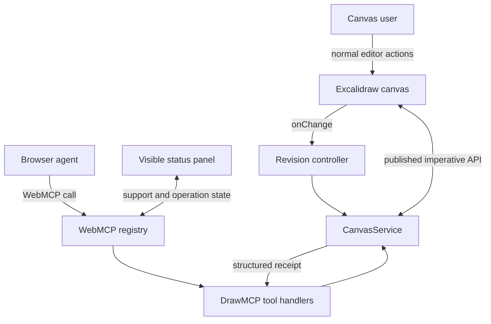
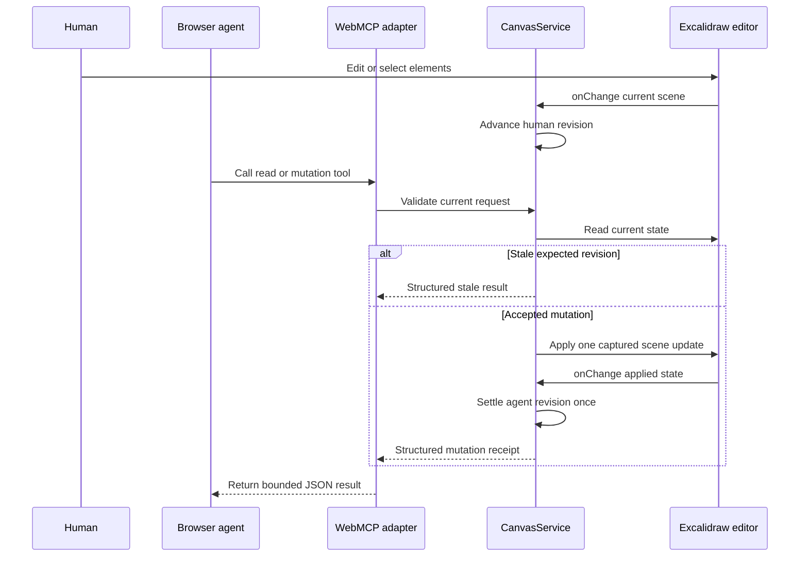
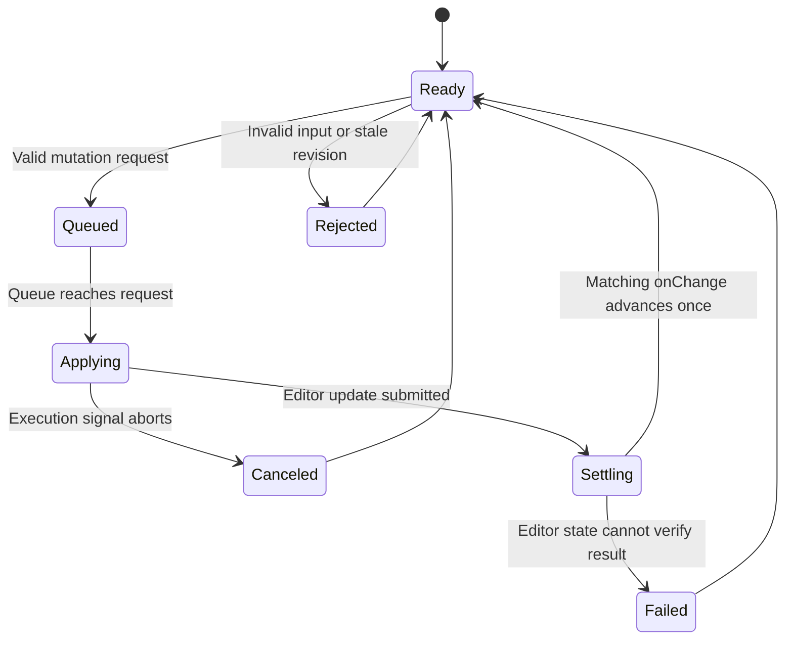

# DrawMCP Core WebMCP - Plan

## Goal Capsule

- **Objective:** A person can open a real Excalidraw canvas and have a browser agent discover, inspect, and modify that same live drawing through reliable page-native WebMCP tools while preserving human control.
- **Means:** Build the WebMCP core inside the smallest usable DrawMCP canvas before building the marketing site, comparison presentation, or documentation experience.
- **Product authority:** This plan owns the page-owned canvas state, WebMCP tool behavior, human-agent continuity, and proof of those tools in ChatGPT's in-app browser.
- **Open blockers:** None at the product-contract level. Planning must reconcile the installed Excalidraw API with the newer vendored source and choose a registration wrapper that preserves the current WebMCP execution contract.

---

## Product Contract

### Summary

DrawMCP will expose a complete, bounded WebMCP tool surface over one live Excalidraw canvas. Human editing remains the primary interface, and browser agents operate the same current selection, elements, viewport, and revision without a separate MCP server or state handoff.

### Problem Frame

The official Excalidraw MCP App can generate and continue diagrams through a remote MCP server, widget context, and checkpoints. That is strong for server-owned tool access, but it does not demonstrate the browser-native case where a website makes its current signed-in or page-local experience directly available to an agent.

DrawMCP needs a trustworthy WebMCP foundation before a polished comparison can make credible claims. Building the homepage first would create a showcase around an unproven integration and make failures harder to diagnose.

### Key Decisions

- **Build the WebMCP core before the website** (session-settled: user-directed — chosen over website-first: the showcase must wrap a proven interaction rather than lead it). Governs R1-R12.
- **Use the exact published Excalidraw package API** (session-settled: user-directed — chosen over private upstream internals: DrawMCP must remain an integration, not a fork). Governs R2, R3, R8.
- **Register page tools imperatively at the top level** (session-settled: user-approved — chosen over declarative or iframe tools: the captured ChatGPT implementation discovers the top-level imperative surface). Governs R4, R6, R7.
- **Keep the core local and unauthenticated** (session-settled: user-approved — chosen over adding product auth or a second host: accounts do not strengthen the first WebMCP proof). Governs R1, R12.

### Actors

- A1. **Canvas user:** Draws, selects, moves, edits, deletes, and undoes work in the normal Excalidraw interface.
- A2. **Browser agent:** Discovers DrawMCP's tools and acts only through their declared contracts.
- A3. **DrawMCP page:** Owns tool registration, state validation, conflict handling, and operation receipts.
- A4. **Excalidraw editor:** Owns canonical drawing state, selection, viewport, files, and undo/redo behavior through its published API.

### Requirements

**Human canvas and state ownership**

- R1. DrawMCP must present a fully usable Excalidraw canvas even when WebMCP is unavailable.
- R2. The mounted Excalidraw editor must remain the canonical state for both human and agent interactions.
- R3. DrawMCP must read and mutate editor state only through APIs published by the installed `@excalidraw/excalidraw` package.

**WebMCP tool surface**

- R4. The top-level page must expose bounded tools for canvas summary, current selection, element creation, element updates, element deletion, viewport focus, and deterministic diagram organization.
- R5. Every tool execution must read the current canvas state at call time rather than a render-time snapshot.
- R6. Tool registrations must follow the page and component lifecycle, disappear when their owning canvas is gone, and allow an in-flight execution to observe cancellation when the platform supplies it.
- R7. Every tool must use a closed and size-bounded input schema, accurately describe visible effects, and attach read-only or untrusted-content hints only when their behavior justifies them.

**Mutations and continuity**

- R8. Agent mutations must be visible in the editor, preserve Excalidraw element invariants, and participate in undo/redo as coherent user-facing operations.
- R9. Mutating tools must prevent a stale agent operation from silently overwriting a human edit made after the agent's last read.
- R10. Every tool must return a compact structured receipt that lets the agent and user verify what state was read or changed.

**Proof and scope discipline**

- R11. The complete tool set must be enumerated and exercised against a deployed preview in ChatGPT's in-app browser before homepage work begins.
- R12. The core must not require accounts, OAuth, a custom backend, Render, or an embedded model/chat client.

<!-- ce-section: work-relationships -->

### How This Work Fits Together

This plan owns only the WebMCP canvas foundation. The broader project remains a set of later, separately verifiable areas:

- **Website and visual system** — Depends on this plan; wraps the proven canvas and tools in the public DrawMCP experience.
  - **Autoplay side-by-side homepage** — Depends on verified MCP and WebMCP proof artifacts; presents synchronized live-lane captures with evidence-first replay.
  - **`/docs` connection guide** — Depends on stable tool names and verified Codex setup; documents DrawMCP's no-install WebMCP path and the official Excalidraw MCP baseline.
- **Vercel launch on `drawmcp.dev`** — Depends on a green preview and in-app-browser proof; provides hosting, HTTPS, domain, and production revision evidence.
- **Hackathon submission** — Depends on the production site, public repository, demo video, and side-by-side proof.
- **Official Excalidraw MCP contribution** — Depends on the live proof and maintainer alignment; remains independent of the DrawMCP product shell.

### Key Flows

- F1. Page initialization
  - **Trigger:** A1 opens the DrawMCP canvas.
  - **Actors:** A1, A3, A4.
  - **Steps:** The editor initializes; the page establishes current state and revision; WebMCP tools register only when their state owner is ready; unsupported browsers retain the normal canvas.
  - **Outcome:** The human can draw, and a compatible agent can discover the current page tools.
  - **Covers:** R1-R7.

- F2. Current-state inspection
  - **Trigger:** A2 requests a canvas summary or selection.
  - **Actors:** A2, A3, A4.
  - **Steps:** The page reads the live editor state; minimizes and bounds the response; marks canvas-authored content as untrusted where supported; returns the current revision.
  - **Outcome:** The agent receives enough current context to act without receiving binary files or unrelated application state.
  - **Covers:** R5, R7, R10.

- F3. Agent mutation
  - **Trigger:** A2 calls an add, update, delete, focus, or organize tool.
  - **Actors:** A1, A2, A3, A4.
  - **Steps:** The page validates input and revision; derives a mutation through the published editor API; applies one visible operation; reads the resulting state; returns a receipt.
  - **Outcome:** The canvas visibly changes and A1 can undo the operation.
  - **Covers:** R3-R10.

- F4. Human edit followed by agent continuation
  - **Trigger:** A1 changes the canvas after an agent read or mutation.
  - **Actors:** A1, A2, A3, A4.
  - **Steps:** The editor reports the human change; DrawMCP advances the revision; the next agent read observes the new state; a stale mutation fails rather than reverting it.
  - **Outcome:** Human and agent turns compose without a checkpoint export/import handoff or silent data loss.
  - **Covers:** R2, R5, R8-R10.

### Acceptance Examples

- AE1. Canvas without WebMCP
  - **Covers R1, R12.**
  - **Given:** The browser does not expose `document.modelContext`.
  - **When:** A1 opens DrawMCP and edits a diagram.
  - **Then:** The editor works normally and the page accurately reports that site tools are unavailable.

- AE2. Live selection read
  - **Covers R2, R4, R5, R10.**
  - **Given:** A1 selects two current elements.
  - **When:** A2 invokes the selection tool.
  - **Then:** The result contains exactly those current elements in compact form and the current scene revision.

- AE3. Undoable agent creation
  - **Covers R3, R4, R7-R10.**
  - **Given:** A2 has the current revision and valid bounded element inputs.
  - **When:** A2 adds a connected set of shapes.
  - **Then:** The shapes appear in the canvas, the receipt names affected IDs and the new revision, and one human undo reverses the coherent agent operation.

- AE4. Stale mutation protection
  - **Covers R5, R9, R10.**
  - **Given:** A2 read revision 4 and A1 edits the canvas, producing revision 5.
  - **When:** A2 attempts a mutation expecting revision 4.
  - **Then:** DrawMCP rejects the mutation, reports revision 5, and preserves the human edit.

- AE5. Tool teardown
  - **Covers R6.**
  - **Given:** The page registered its tools for the active canvas.
  - **When:** The owning canvas unmounts or the page navigates away.
  - **Then:** The registrations are aborted and no stale tool can mutate the destroyed editor.

- AE6. Real in-app-browser proof
  - **Covers R11.**
  - **Given:** A Vercel preview is deployed from a known commit.
  - **When:** Codex opens it in ChatGPT's in-app browser.
  - **Then:** All required tools are listed and each tool completes its acceptance path against the visible canvas.

### Success Criteria

- The seven tools are discoverable from the top-level deployed page with stable names and declared schemas.
- A human edit made between agent turns is observed and preserved by the next tool call.
- All mutating tools produce visible, verifiable, undoable behavior or a structured failure.
- The same canvas remains usable with site tools disabled or unavailable.
- In-app-browser proof identifies the exact Vercel deployment and Git commit tested.

### Scope Boundaries

**Deferred for later**

- The public homepage and polished visual design.
- Autoplay MCP-versus-WebMCP comparison playback and proof browser.
- The Codex-first `/docs` guide and generic MCP configuration reference.
- Production-domain attachment, demo recording, public-repository release, and Devpost submission.
- A focused contribution proposal or pull request to `excalidraw/excalidraw-mcp`.

**Outside this work unit**

- End-user accounts, OAuth, multi-user server persistence, billing, and cloud workspaces.
- A custom chat interface, embedded model runtime, or DrawMCP-hosted MCP client.
- Render or another second hosting platform when Vercel satisfies the launch path.
- Imports from private Excalidraw internals or a DrawMCP-maintained Excalidraw fork.

### Dependencies and Assumptions

- The installed `@excalidraw/excalidraw@0.18.1` package is the production API authority even when the pinned upstream master source has newer naming.
- The current OpenAI behavior is grounded in `research/snapshots/openai-webmcp-2026-09-01.md` and must be refreshed or verified live if the platform changes.
- The WebMCP specification is a Community Group draft; the integration must isolate draft-facing code so contract changes remain local.
- The installed WebMCP React hook manages registration lifetime but does not expose execution cancellation in its callback type; planning must choose a compliant boundary without weakening R6.
- The known transitive package advisories remain a release risk to assess before production, not a reason to bypass the published Excalidraw package.

### Sources and Research

- `docs/APPROACH.md`
- `docs/WEBMCP_GUIDELINES.md`
- `docs/PROOF_PLAN.md`
- `research/EXCALIDRAW_ARCHITECTURE.md`
- `research/EXCALIDRAW_MCP_AUDIT.md`
- `research/snapshots/webmcp-spec-2026-09-01.md`
- `research/snapshots/openai-webmcp-2026-09-01.md`
- `vendor/excalidraw/packages/excalidraw/types.ts`
- `vendor/excalidraw/dev-docs/docs/@excalidraw/excalidraw/api/props/excalidraw-api.mdx`
- `vendor/excalidraw-mcp/src/server.ts`
- `vendor/excalidraw-mcp/src/mcp-app.tsx`

---

## Planning Contract

### Product Contract Preservation

Product Contract clarified with no scope change. The three planning-owned questions were resolved by KTD2, KTD6, and KTD7. The implementation plan preserves R1-R12, A1-A4, F1-F4, and AE1-AE6.

### Key Technical Decisions

- KTD1. **Use the installed Excalidraw package as the runtime authority.** DrawMCP will bind to the `excalidrawAPI` callback and types exported by `@excalidraw/excalidraw@0.18.1`. Newer names in `vendor/excalidraw` are research signals, not available runtime APIs. (session-settled: user-directed — chosen over private upstream internals: the integration must build on the exact published API.) Governs R2, R3, R8.
- KTD2. **Own a small WebMCP registration adapter.** The adapter will await `document.modelContext.registerTool` and surface asynchronous registration failures. It will pass execution cancellation options to handlers, preserve registration cleanup and late API detection, and return plain WebMCP values. The implementation will remove `use-webmcp-tool` so one registration contract owns the page. Governs R4, R6, R7, R10.
- KTD3. **Route all state access through one CanvasService.** Human UI and tools will share the same API holder, mutation queue, revision controller, element projection, and result receipt logic. This prevents each tool from inventing its own state semantics. Governs R2, R5, R8-R10.
- KTD4. **Use JSON Schema 2020-12 as the validation source.** Tool schemas will be closed, size-bounded objects and compiled at runtime with the pinned `ajv@8.20.0` dependency. TypeScript input types will remain local projections of those contracts. Governs R7.
- KTD5. **Accept simplified Excalidraw skeletons for creation.** The canvas adapter will normalize new elements through the package's exported skeleton conversion before applying them with an immediate capture update. Update and delete tools will operate on stable current IDs with an explicit field allowlist. Governs R3, R7-R9.
- KTD6. **Count one revision per accepted visible scene change.** Agent operations will reserve an operation token before `updateScene`; the matching change callback will settle that operation once. Unmatched change callbacks count as human edits. The mutation queue checks `expected_revision` after prior operations settle. Governs R5, R8-R10.
- KTD7. **Keep organization deterministic and local.** The first layout engine will support a bounded set of node-and-connector arrangements over the current selection or whole scene. It will check execution cancellation between layout stages and will not call a model or network service. Governs R4, R6-R9, R12.

### Assumptions

- The dated OpenAI snapshot remains representative of ChatGPT's in-app-browser discovery behavior during implementation. Live preview verification remains the authority before completion.
- Vite serves the Excalidraw component entirely on the client, so no SSR boundary is needed for this work unit.
- A direct JSON Schema validator is acceptable as a small runtime dependency because it prevents drift between browser-advertised schemas and execute-time validation.
- Excalidraw's `CaptureUpdateAction.IMMEDIATELY` produces the coherent undo behavior required by R8 when one tool applies one final scene update. Integration tests and live proof must verify this assumption.
- The first organization layouts can exclude images, freedraw, frames, embeds, and complex grouped elements while preserving them unchanged in the scene.

### Tool Contract Matrix

| Tool | Input contract | Observable effect | Annotations |
| --- | --- | --- | --- |
| `get_canvas_summary` | Closed empty object | Reads current revision, type counts, bounds, selection count, and up to 200 compact element projections | `readOnlyHint: true`, `untrustedContentHint: true` |
| `get_selection` | Closed empty object | Reads the current selected IDs and up to 100 compact selected-element projections | `readOnlyHint: true`, `untrustedContentHint: true` |
| `add_elements` | Up to 50 supported skeletons plus optional non-negative `expected_revision` | Adds normalized elements as one undoable scene operation | `untrustedContentHint: false` |
| `update_elements` | Up to 100 ID-addressed allowlisted patches plus optional non-negative `expected_revision` | Updates current elements as one undoable scene operation | `untrustedContentHint: false` |
| `delete_elements` | Up to 100 current element IDs plus optional non-negative `expected_revision` | Deletes current elements and owned bound text as one undoable scene operation | `untrustedContentHint: false` |
| `fit_to_content` | Scope `selection` or `all`, plus optional animation flag | Changes the visible viewport without changing scene revision | `untrustedContentHint: false` |
| `organize_diagram` | Scope `selection` or `all`; layout `horizontal`, `vertical`, or `grid`; spacing 20-500; optional non-negative `expected_revision` | Repositions supported nodes and connectors as one undoable scene operation | `untrustedContentHint: false` |

Supported creation types are `rectangle`, `ellipse`, `diamond`, `text`, `arrow`, and `line`. IDs use 1-128 ASCII alphanumeric, underscore, or hyphen characters. Text is capped at 2,000 characters per element. Coordinates are finite and limited to an absolute value of 1,000,000. Dimensions are finite values from 1 through 100,000.

Compact projections return stable ID, type, geometry, supported text, basic style, binding IDs, and lock state. Summary responses set `truncated: true` when the scene exceeds the projection cap. Normal tools never return binary file contents, full app state, internal version fields, seeds, nonces, or browser storage.

### High-Level Technical Design

The prose and R/KTD entries remain authoritative. The diagrams show the topology, interaction sequence, and revision lifecycle that implementation must preserve.

**Component topology**



**Read and mutation sequence**



**Mutation and revision lifecycle**



### Output Structure

```text
src/
  components/
    DrawMcpCanvas.tsx
    DrawMcpCanvas.test.tsx
    WebMcpStatus.tsx
  excalidraw/
    canvas-service.ts
    canvas-service.test.ts
    element-projection.ts
    element-projection.test.ts
    revision-controller.ts
    revision-controller.test.ts
  layout/
    organize-diagram.ts
    organize-diagram.test.ts
  webmcp/
    model-context.d.ts
    register-tools.ts
    register-tools.test.ts
    tool-contracts.ts
    tool-contracts.test.ts
    tool-handlers.ts
    tool-handlers.test.ts
    tool-results.ts
  test/
    setup.ts
proof/
  webmcp/
    README.md
```

The implementation may consolidate files when a boundary proves too small. It must preserve the ownership lines in KTD2-KTD7.

### Sequencing

1. Establish the test environment and standards-facing adapter types.
2. Replace the Vite demo with the real Excalidraw canvas and capture the installed imperative API.
3. Build the current-state, revision, projection, and mutation service before registering tools.
4. Register read tools first and verify live current-state access.
5. Add primitive mutations, then focus and deterministic organization.
6. Complete fallback/status behavior and the human-agent continuity integration tests.
7. Deploy a preview and record real in-app-browser proof before any website work begins.

### System-Wide Impact

- **Agent/tool parity:** The tool layer becomes a public interaction surface over the same domain action as the editor UI. Future canvas actions must be assessed for UI/tool parity.
- **Protocol compatibility:** WebMCP is a draft external contract. All draft-facing types and registration behavior stay under `src/webmcp/` so a spec change has one migration boundary.
- **Data lifecycle:** Core state remains browser-page state. Tools do not add cloud persistence, uploads, or new data transmission.
- **Security posture:** Canvas text is untrusted output. Tool schemas reduce the authority of each call and avoid arbitrary code, HTML, selectors, URLs, or file paths.
- **Undo history:** Agent changes become local user-facing history entries. A tool that cannot preserve editor invariants or undo semantics is incomplete.

### Alternative Approaches Considered

| Approach | Decision | Reason |
| --- | --- | --- |
| Use `use-webmcp-tool` for every tool | Rejected for the core adapter | Its current execute callback omits the specification's execution options signal and normalizes returns as MCP-server content blocks. |
| Fork Excalidraw and add tools inside its source | Rejected | It breaks the exact-package boundary, increases maintenance cost, and is unnecessary for the published imperative API surface. |
| Expose only one coarse `create_view`-style tool | Rejected | It cannot prove selection-aware shared state or bounded human-agent continuation across the full R4 surface. |
| Add a backend checkpoint service | Deferred | Page-owned state and revision control satisfy the core proof without a second canonical store. |
| Build the homepage first | Rejected by product decision | The comparison must wrap independently verified WebMCP behavior. |

### Risks and Mitigations

| Risk | Impact | Mitigation |
| --- | --- | --- |
| WebMCP draft or in-app-browser behavior changes | Tool registration or discovery can fail despite local tests | Isolate the adapter, bind decisions to the dated reference, and require live preview enumeration. |
| Installed Excalidraw API differs from upstream master | An implementer may use unavailable callback names or types | Treat installed package declarations as authoritative and keep vendored source as comparative research. |
| `onChange` double-counts an agent update | Expected revisions drift and later calls fail incorrectly | Use an operation token plus verified post-update fingerprint and test the callback integration. |
| Array replacement damages bindings or history | Canvas state becomes inconsistent or undo is fragmented | Normalize creation, preserve stable IDs and untouched elements, and apply one captured update per operation. |
| Large canvas or tool payload blocks the UI | Poor agent and human experience | Bound tool inputs and read projections, avoid binary payloads, and check cancellation in layout work. |
| Canvas text contains prompt injection | Agent may treat user-authored text as instructions | Bound returned text and attach the untrusted-content hint on state-reading tools. |
| Dependency advisories remain unresolved | Release risk or submission concern | Document the transitive paths, assess reachable use, and resolve or explicitly accept before production launch. |
| Headless component tests pass while host integration fails | False confidence in WebMCP readiness | Keep deployed in-app-browser enumeration and real tool calls as a distinct completion gate. |

### Documentation and Operational Notes

- Update `README.md` only with the verified core tool list and local development path after implementation.
- Keep `docs/WEBMCP_GUIDELINES.md` aligned with the final registration adapter and any live platform divergence.
- Record preview proof in `proof/webmcp/README.md` with deployment URL, deployment ID, Git commit, tool list, call receipts, and visible-state observations.
- Keep the raw specification snapshot at `research/snapshots/webmcp-spec-2026-09-01.md` unchanged during implementation. Refresh it only as an explicit research update with a reviewed diff.

---

## Implementation Units

### U1. Test and protocol foundation

**Goal:** Add the test environment and project-owned WebMCP types, validation, and registration lifecycle needed by every tool.

**Requirements:** R4, R6, R7, R10; F1; AE5; KTD2, KTD4.

**Dependencies:** None.

**Files:**

- Modify `package.json` and `package-lock.json`.
- Modify `vite.config.ts` or add `vitest.config.ts` if separation keeps production configuration clearer.
- Create `src/test/setup.ts`.
- Create `src/webmcp/model-context.d.ts`.
- Create `src/webmcp/tool-contracts.ts`.
- Create `src/webmcp/tool-contracts.test.ts`.
- Create `src/webmcp/tool-results.ts`.
- Create `src/webmcp/register-tools.ts`.
- Create `src/webmcp/register-tools.test.ts`.

**Approach:**

1. Add Vitest, jsdom, React Testing Library support, and `ajv@8.20.0`; remove `use-webmcp-tool` after parity tests cover its useful lifecycle behavior.
2. Declare only the WebMCP surface used by DrawMCP, matching the stored specification's tool, annotation, registration, and execution options concepts.
3. Make registration accept stable tool definitions and current handler references without React render churn.
4. Feature-detect late platform injection for a bounded interval.
5. Await each registration promise and convert synchronous or asynchronous registration failure into visible support state.
6. Use one registration-lifetime abort controller per mounted tool set and pass each call's execution signal through to handlers.
7. Return plain structured JSON values and structured errors rather than MCP-server response blocks.

**Execution note:** Start with failing adapter tests for lifecycle cleanup and execution cancellation before connecting the browser API.

**Patterns to follow:**

- `node_modules/use-webmcp-tool/useWebMCP.js` for late detection, stable callback refs, and registration cleanup.
- `research/snapshots/webmcp-spec-2026-09-01.md` for the complete registration and execution contracts.
- `research/snapshots/openai-webmcp-2026-09-01.md` for the top-level imperative compatibility boundary.

**Test scenarios:**

- Register a read-only tool when `document.modelContext.registerTool` is available and expose its exact name, title, description, schema, and annotations.
- Resolve asynchronous registration and report success only after the returned promise settles.
- Reject synchronous and asynchronous registration failures without leaving the UI in a registered state.
- Keep the page usable and report unsupported state when `document.modelContext` is absent.
- Detect a model context injected after mount and register once without leaking polling timers.
- Under React StrictMode, abort the first mount and leave one live registration.
- Abort every registration when the owning component unmounts.
- Pass a call-level abort signal to a handler and return a structured canceled result when it aborts.
- Reject a payload with unknown fields, excessive arrays, oversized text, invalid coordinates, or unsupported enum values.
- Preserve canvas-derived output as plain JSON and flag it with `untrustedContentHint` where required.

**Verification:** The adapter tests prove registration, cleanup, late detection, cancellation, schema rejection, and result shape without an Excalidraw dependency.

### U2. Exact Excalidraw canvas boundary

**Goal:** Replace the Vite demo with a usable Excalidraw canvas that exposes the installed imperative API to DrawMCP-owned services.

**Requirements:** R1-R3, R8, R12; A1, A4; F1; AE1; KTD1.

**Dependencies:** U1 for the test environment.

**Files:**

- Replace `src/App.tsx`.
- Replace `src/App.css`.
- Modify `src/index.css`.
- Create `src/components/DrawMcpCanvas.tsx`.
- Create `src/components/DrawMcpCanvas.test.tsx`.
- Remove unused Vite starter assets from `src/assets/` and `public/` when no longer referenced.

**Approach:**

1. Import the package stylesheet and mount the editor in a viewport-height container.
2. Capture the installed package's `excalidrawAPI` callback in a stable holder.
3. Expose readiness through DrawMCP context without duplicating editor state in React.
4. Keep the canvas interactive when the WebMCP adapter reports unsupported or unavailable.
5. Add a small non-blocking status region outside the editor interaction surface.

**Patterns to follow:**

- `vendor/excalidraw/packages/excalidraw/README.md` for package embedding constraints.
- `node_modules/@excalidraw/excalidraw/dist/types/excalidraw/types.d.ts` for the installed callback and imperative API.
- `vendor/excalidraw-mcp/src/mcp-app.tsx` only as evidence for fullscreen editor API use; do not copy its MCP App wrapper.

**Test scenarios:**

- Covers AE1. Render the app without `document.modelContext`; the Excalidraw shell mounts and the fallback status remains accurate.
- Capture a mocked installed `excalidrawAPI` callback and make it available to the service boundary once.
- Unmount the editor and mark the API unavailable so stale handlers cannot act on a destroyed instance.
- Verify the canvas container has non-zero viewport dimensions and package CSS is included.
- Verify the status region does not cover or disable standard editor controls.

**Verification:** A local browser smoke run supports normal drawing, selection, delete, undo, and redo before any tool is invoked.

### U3. Canvas state, projection, and revision service

**Goal:** Establish current-state reads, compact projections, serialized mutations, and one revision per accepted visible change.

**Requirements:** R2, R3, R5, R8-R10; F2-F4; AE2-AE4; KTD3, KTD5, KTD6.

**Dependencies:** U2.

**Files:**

- Create `src/excalidraw/canvas-service.ts`.
- Create `src/excalidraw/canvas-service.test.ts`.
- Create `src/excalidraw/element-projection.ts`.
- Create `src/excalidraw/element-projection.test.ts`.
- Create `src/excalidraw/revision-controller.ts`.
- Create `src/excalidraw/revision-controller.test.ts`.
- Modify `src/components/DrawMcpCanvas.tsx`.
- Modify `src/components/DrawMcpCanvas.test.tsx`.

**Approach:**

1. Read elements, app state, and files only through the current imperative API holder.
2. Project elements into bounded agent-facing fields and omit binary file contents.
3. Track current revision, last actor, last operation, and mutation state outside the React render snapshot.
4. Serialize mutations and check `expected_revision` immediately before applying them.
5. Tag an accepted agent operation until the matching `onChange` settles it once.
6. Treat unmatched editor changes as human revisions.
7. Verify the applied state before returning a receipt.

**Execution note:** Add characterization-style integration tests around the mocked Excalidraw callback before implementing revision suppression.

**Patterns to follow:**

- `node_modules/@excalidraw/excalidraw/dist/types/excalidraw/components/App.d.ts` for installed update and read contracts.
- `vendor/excalidraw-mcp/src/edit-context.ts` for the idea of compact human-edit context, adapted to a page-local revision model.
- `docs/WEBMCP_GUIDELINES.md` for state minimization and receipt rules.

**Test scenarios:**

- Covers AE2. Read selected IDs from the latest app state and return exactly the matching current elements and revision.
- Return element counts, bounds, and bounded labels for an empty, small, and oversized scene.
- Exclude deleted elements and binary file data from normal projections.
- Apply one agent update, receive its callback echo, and advance the revision exactly once with actor `agent`.
- Receive an unmatched human callback and advance once with actor `human`.
- Covers AE4. Queue a mutation for revision 4, receive a human edit to revision 5, and reject the stale mutation without calling `updateScene`.
- Queue two valid agent mutations and apply them in order against the revision produced by the prior mutation.
- Abort a queued operation before apply and preserve canvas state and revision.
- Fail closed when the imperative API is missing or destroyed.

**Verification:** Service tests demonstrate current-state reads, projection bounds, single-count revisions, serialized mutation order, stale rejection, cancellation, and verified receipts.

### U4. Canvas read tools

**Goal:** Register `get_canvas_summary` and `get_selection` over the current CanvasService state.

**Requirements:** R4-R7, R10; A2-A4; F2; AE2; KTD2-KTD4.

**Dependencies:** U1, U3.

**Files:**

- Create `src/webmcp/tool-handlers.ts`.
- Create `src/webmcp/tool-handlers.test.ts`.
- Modify `src/webmcp/tool-contracts.ts`.
- Modify `src/components/DrawMcpCanvas.tsx`.
- Modify `src/components/DrawMcpCanvas.test.tsx`.

**Approach:**

1. Define stable names, human-readable titles, side-effect descriptions, and closed empty/filter schemas.
2. Read through CanvasService inside each execute call.
3. Return revision, selection, counts, bounds, and bounded projected content.
4. Mark both tools read-only and mark canvas-derived results as untrusted.
5. Expose aggregate registration state to the visible status region.

**Patterns to follow:**

- `research/snapshots/openai-webmcp-2026-09-01.md` for a read-only top-level site tool.
- `research/snapshots/webmcp-spec-2026-09-01.md` for annotations and execution options.
- `vendor/excalidraw-mcp/src/server.ts` for concise agent-facing descriptions and explicit input limits.

**Test scenarios:**

- `get_canvas_summary` on an empty scene returns revision, zero counts, and empty bounds without an error.
- `get_canvas_summary` on mixed elements returns bounded type counts, labels, selection count, and scene bounds.
- Covers AE2. `get_selection` reflects a selection changed after registration and before execution.
- `get_selection` returns an empty successful result when nothing is selected.
- Both tools reject unexpected input properties.
- Both registrations advertise accurate read-only and untrusted-content annotations.
- Both handlers stop promptly when their execution signal is already aborted.

**Verification:** Unit and component tests prove current-state reads, stable schemas, annotations, bounded output, and visible registration status.

### U5. Primitive mutation tools

**Goal:** Register safe `add_elements`, `update_elements`, and `delete_elements` tools with revision checks and coherent editor history.

**Requirements:** R3-R10; A1-A4; F3-F4; AE3-AE5; KTD2-KTD6.

**Dependencies:** U3, U4.

**Files:**

- Modify `src/webmcp/tool-contracts.ts`.
- Modify `src/webmcp/tool-handlers.ts`.
- Modify `src/webmcp/tool-handlers.test.ts`.
- Modify `src/excalidraw/canvas-service.ts`.
- Modify `src/excalidraw/canvas-service.test.ts`.

**Approach:**

1. Bound element arrays, patch arrays, IDs, coordinates, dimensions, style values, and text lengths.
2. Normalize add inputs with the package's exported skeleton conversion and preserve caller-supplied stable IDs only after uniqueness checks.
3. Patch only allowlisted current fields and preserve untouched element properties and bindings.
4. Delete by stable current ID without exposing arbitrary selectors or natural-language matching.
5. Apply each accepted call as one immediate capture update and verify the resulting IDs and count.
6. Return revision before/after, affected IDs, counts, and a concise summary.

**Execution note:** Implement each mutation test-first, beginning with invalid and stale inputs so unsafe paths fail before the happy path exists.

**Patterns to follow:**

- `vendor/excalidraw/dev-docs/docs/@excalidraw/excalidraw/api/excalidraw-element-skeleton.mdx` for simplified element conversion.
- `vendor/excalidraw/dev-docs/docs/@excalidraw/excalidraw/api/props/excalidraw-api.mdx` for `updateScene` and capture semantics.
- `vendor/excalidraw-mcp/src/server.ts` for input size caps and checkpoint-era deletion considerations.

**Test scenarios:**

- Covers AE3. Add connected labeled shapes, preserve requested unique IDs, return the new revision, and reverse the operation with one editor undo integration assertion.
- Reject duplicate IDs, unsupported element types, invalid dimensions, excessive elements, and oversized text without changing revision.
- Update position, size, style, and supported text fields while preserving all unpatched element fields.
- Reject patches to internal versioning, binding, deletion, binary, or arbitrary custom fields.
- Delete existing IDs and report missing IDs without deleting unrelated elements.
- Covers AE4. Reject add, update, and delete calls with stale expected revisions before applying state.
- Abort during input preparation and before apply without a partial canvas mutation.
- Serialize two mutation calls and verify the second receipt starts from the first receipt's revision.
- Return a structured failure when post-update state does not contain the expected result.

**Verification:** Primitive tool tests cover every accepted field group, each rejection class, stale protection, cancellation, mutation ordering, and visible undo behavior.

### U6. Focus and deterministic organization tools

**Goal:** Register `fit_to_content` and `organize_diagram` with visible focus behavior and bounded deterministic layouts.

**Requirements:** R3-R10, R12; F3-F4; AE3-AE5; KTD2-KTD7.

**Dependencies:** U3, U5.

**Files:**

- Create `src/layout/organize-diagram.ts`.
- Create `src/layout/organize-diagram.test.ts`.
- Modify `src/webmcp/tool-contracts.ts`.
- Modify `src/webmcp/tool-handlers.ts`.
- Modify `src/webmcp/tool-handlers.test.ts`.
- Modify `src/excalidraw/canvas-service.ts`.

**Approach:**

1. Let focus target the current selection or all current elements through the published viewport method.
2. Define a small layout enum for horizontal flow, vertical flow, and grid.
3. Organize selected supported nodes by default; use all supported nodes only when requested.
4. Preserve unsupported and non-target elements unchanged.
5. Recompute supported connector endpoints or bindings only through the safe element conversion/update boundary.
6. Check cancellation between analysis, placement, connector adjustment, and apply.
7. Return target IDs, skipped IDs, layout, and revision receipt.

**Patterns to follow:**

- Installed `scrollToContent` declarations under `node_modules/@excalidraw/excalidraw/dist/types/excalidraw/` for viewport behavior.
- `vendor/excalidraw-mcp/src/mcp-app.tsx` for the principle that viewport changes must remain visible to the user.
- KTD7 for deterministic local scope.

**Test scenarios:**

- Focus selected elements and verify the current selection is passed to the viewport API.
- Focus all current elements when selection scope is not requested.
- Return a structured not-found result when selection scope is requested with no selection.
- Organize three nodes horizontally, vertically, and in a grid with deterministic non-overlapping positions.
- Organize only selected nodes and preserve non-selected coordinates exactly.
- Preserve images, freedraw, frames, embeds, and complex unsupported elements while reporting them as skipped.
- Preserve labels and supported connector relationships after layout.
- Reject an unknown layout, invalid spacing, oversized target set, or stale revision.
- Cancel between layout stages and avoid applying a partial arrangement.
- Reverse an accepted organization call as one coherent editor history action.

**Verification:** Layout tests prove determinism, selection scope, preservation, connector behavior, cancellation, stale protection, and coherent undo.

### U7. Integrated status, fallback, and continuity journey

**Goal:** Join the canvas, service, and seven tools into a visible local experience that proves human-agent continuity before deployment.

**Requirements:** R1-R12; A1-A4; F1-F4; AE1-AE5; KTD1-KTD7.

**Dependencies:** U2-U6.

**Files:**

- Create `src/components/WebMcpStatus.tsx`.
- Modify `src/components/DrawMcpCanvas.tsx`.
- Modify `src/components/DrawMcpCanvas.test.tsx`.
- Modify `src/App.tsx` and `src/App.css`.
- Modify `src/index.css`.
- Modify `README.md`.
- Modify `docs/WEBMCP_GUIDELINES.md` only for verified implementation deltas.

**Approach:**

1. Show support, registration count, current revision, last actor, and last operation without obstructing the canvas.
2. Keep errors actionable and local; do not expose stack traces or browser internals to the agent result.
3. Wire the registration set to canvas readiness and service lifetime.
4. Exercise the human-edit-followed-by-agent path through component-level integration tests.
5. Document only the exact tool surface and behavior that tests prove.

**Patterns to follow:**

- `AGENTS.md` for proof-level language and WebMCP rules.
- `docs/PROOF_PLAN.md` for the acceptance journey.
- Existing Vite accessibility structure for status semantics, replacing the starter presentation.

**Test scenarios:**

- Covers AE1. Unsupported WebMCP shows zero registered tools while the canvas remains editable.
- Register all seven tools after canvas readiness and show accurate status without duplicate registration under StrictMode.
- Covers F4 / AE4. Read revision, simulate a human move, observe the next revision, reject the stale agent write, then accept a refreshed write without reverting the move.
- Covers AE5. Unmount the canvas, abort registrations, and reject any retained stale handler through the destroyed service guard.
- Surface schema, cancellation, stale-revision, and editor failures without losing the current canvas.
- Keep canvas keyboard, pointer, and undo behavior functional with the status UI mounted.

**Verification:** The local integrated journey passes in component tests and a manual browser smoke run with a fake model context before deployment.

### U8. Vercel preview and real WebMCP proof

**Goal:** Deploy the verified core to a Vercel preview and prove the complete tool surface in ChatGPT's in-app browser against a known revision.

**Requirements:** R6, R7, R10-R12; F1-F4; AE1-AE6.

**Dependencies:** U7 and a green local Verification Contract.

**Files:**

- Create `proof/webmcp/README.md`.
- Add sanitized JSON receipts and screenshots under `proof/webmcp/` only when they contain no private account, browser, or unrelated canvas data.
- Modify `.github/workflows/ci.yml` if the final test scripts require CI coverage changes.
- Modify `README.md` with the verified preview proof level.

**Approach:**

1. Link the private GitHub repository to a Vercel project and deploy the exact feature revision as a preview.
2. Record the Vercel project, deployment ID, deployment URL, Git commit, and build result.
3. Open the preview in ChatGPT's in-app browser and enumerate the page-defined tools.
4. Invoke every read and mutation tool against the visible canvas.
5. Repeat the human-edit continuity and undo journey.
6. Store only sanitized proof artifacts and distinguish preview proof from production/domain proof.

**Execution note:** Treat deployment readiness, page load, tool discovery, tool execution, visible canvas state, and undo as separate gates. A prior gate does not imply a later one.

**Patterns to follow:**

- `docs/PROOF_PLAN.md` for proof levels and evidence shape.
- `.github/workflows/ci.yml` for the remote source verification baseline.
- `research/snapshots/openai-webmcp-2026-09-01.md` for expected in-app-browser compatibility.

**Test scenarios:**

- Covers AE6. Enumerate exactly the intended seven tool names and inspect their live schemas and annotations.
- Call both read tools and verify their receipts match the current visible selection and canvas.
- Call all five visible mutation/UI tools and verify each resulting canvas state and receipt.
- Perform a human edit between calls and verify the next read sees it.
- Attempt a stale mutation and verify the human edit remains visible.
- Undo and redo each class of mutation in the live editor.
- Navigate away or close the page and confirm page tools no longer belong to the old document.
- Load the preview in a browser without WebMCP and verify normal canvas fallback.

**Verification:** The proof record identifies the tested preview revision and contains enough sanitized evidence to independently distinguish local checks, Vercel build success, live page behavior, and real WebMCP tool calls.

---

## Verification Contract

| Gate | Applies to | Expected result |
| --- | --- | --- |
| `npm run test` | U1-U7 | All unit and component scenarios pass in one non-watch run. |
| `npm run lint` | U1-U7 | DrawMCP-owned source, tests, and configuration have no lint errors. |
| `npm run build` | U2-U8 | TypeScript and Vite produce a production bundle from the installed package API. |
| `git diff --check` | U1-U8 | The change set contains no whitespace errors. |
| Dependency review | U1, U8 | New direct dependencies are justified; known Excalidraw transitive advisories have a recorded release decision. |
| Local canvas smoke | U2, U7 | Drawing, selection, deletion, focus, undo, and redo work without WebMCP. |
| Fake model-context integration | U1, U4-U7 | Seven tools register once, use live state, cancel, tear down, and return verified receipts. |
| GitHub CI | U1-U8 | Install, test, lint, and build pass on the exact pushed revision. |
| Vercel preview build | U8 | The exact Git revision reaches `READY` with no build error. |
| In-app-browser discovery | U8 | The preview exposes the expected top-level tool set with accurate schemas and annotations. |
| In-app-browser behavior | U8 | Every tool completes its acceptance path against the visible canvas. |
| Human-agent continuity | U7, U8 | A human edit advances revision, survives stale rejection, and remains in the next accepted agent mutation. |
| Undo/redo | U5-U8 | Each accepted agent mutation is visibly reversible and repeatable through the editor history. |

No production-domain, DNS, TLS, public-repository, submission, or upstream-PR claim belongs to this plan's completion. Those are deferred proof levels.

---

## Definition of Done

### Global completion

- The Product Contract remains unchanged in meaning and every R/F/AE that affects implementation is traced to at least one unit or verification gate.
- The seven tools register from the top-level page only when the Excalidraw API is ready.
- Read tools use current state and return bounded untrusted canvas content.
- Mutation tools validate schemas, serialize operations, protect revisions, preserve IDs, and return structured receipts.
- Agent mutations are visible and undoable through the exact installed Excalidraw API.
- The canvas remains usable with WebMCP unavailable.
- Unit, component, lint, build, and CI gates pass on the exact preview revision.
- A real Vercel preview passes tool enumeration and every acceptance journey in ChatGPT's in-app browser.
- Proof artifacts distinguish local, CI, preview, and live WebMCP claims and contain no sensitive account or browser data.
- Abandoned experiments, unused Vite starter assets, dead adapters, duplicate schemas, and obsolete dependencies are removed from the final diff.

### Per-unit completion

| Unit | Done when |
| --- | --- |
| U1 | The project-owned adapter and schema layer prove lifecycle, cancellation, validation, and result contracts in isolation. |
| U2 | The exact installed Excalidraw package renders a usable canvas and exposes a safe current API holder. |
| U3 | CanvasService proves bounded current reads, serialized mutations, single-count revisions, stale rejection, and verified receipts. |
| U4 | Both read tools register with accurate metadata and read the latest canvas and selection at execution time. |
| U5 | Add, update, and delete tools pass happy, boundary, failure, cancellation, stale, ordering, and undo scenarios. |
| U6 | Focus and organization tools are deterministic, selection-aware, preserving, cancelable, stale-safe, and undoable. |
| U7 | The local integrated canvas shows accurate support/operation status and passes the human-agent continuity journey. |
| U8 | A known Vercel preview revision passes real in-app-browser discovery, tool calls, visible-state assertions, stale protection, fallback, and undo/redo proof. |
