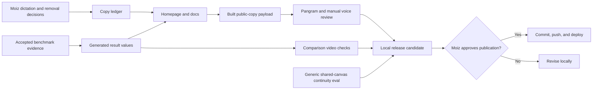

# DrawMCP Human Copy Simplification

## Goal Capsule

### Objective

Make the public DrawMCP experience immediately understandable in Moiz's own
voice: DrawMCP is a WebMCP fork of the current Excalidraw MCP that lets a person
and an agent work on the same open canvas. Remove the tic-tac-toe detour, keep
the side-by-side protocol demonstration, and retain only evidence-backed
performance claims.

### Means

- Freeze Moiz's dictated sentences in a copy ledger before editing UI or docs.
- Replace the public game section with the already-produced official MCP versus
  WebMCP comparison video.
- Retire the public tic-tac-toe route, prompt, assets, and release dependency.
- Replace game-specific proof with a generic human-edit to agent-read/write to
  Undo/Redo continuity evaluation.
- Generate benchmark text from the accepted evidence rather than duplicating
  numbers by hand.
- Validate the exact final public prose, routes, WebMCP behavior, video, build,
  and release receipt before asking for publication approval.

### Authority Order

1. Moiz's dictated wording and explicit keep/remove decisions in this session.
2. Accepted benchmark and evaluation artifacts in `evidence/accepted/`.
3. The WebMCP tool contract and current application behavior.
4. Existing public copy, only where Moiz did not replace or remove it.

### Stop Conditions

- Do not silently substitute model-written marketing prose for Moiz's words.
- Do not claim that WebMCP is universally faster than MCP; state the measured
  workflow and timing boundaries.
- Do not change the seven-tool WebMCP contract as part of this copy pass.
- Do not alter historical receipts under `evidence/releases/`.
- Do not commit, push, deploy, or edit the Devpost submission until Moiz reviews
  the final local result and explicitly approves that step.

### Tail Ownership

Moiz owns the final voice decision, publication approval, Devpost submission,
and any later upstream Excalidraw pull request.

## Product Contract

### Summary

The current site proves a lot, but it asks a judge to process too many parallel
stories: protocol architecture, a playable game, setup instructions, a long
origin story, performance methodology, and repeated calls to action. The new
experience will make one argument clearly:

> DrawMCP applies WebMCP to Excalidraw so the browser agent can work directly
> with the same live canvas as the person.

The homepage will demonstrate that argument with the comparison video. The docs
will explain how to try it in a few short steps. The results page will preserve
the full measurement boundary for anyone who wants to inspect it.

### Approved Copy

The following is canonical, session-settled copy. Implementation must preserve
it verbatim, except that the product name has already been normalized to
`Excalidraw`.

**Primary description**

> DrawMCP is a WebMCP fork of the current Excalidraw MCP that allows the
> interactive use of Excalidraw.

**Shared-canvas description**

> Draw through the normal Excalidraw controls. The agent interacts via WebMCP.

**Results summary**

> Twenty randomized pairs. DrawMCP finished two page calls and changed the
> visible canvas before the official public MCP returned its checkpoint. The
> official widget had not rendered yet.

**Why DrawMCP**

> Excalidraw has a great MCP server, but it's been quite difficult to use due to
> not having the ability to kind of interact with the agent. WebMCP unlocks
> this by allowing us to basically have an agent kind of co-work with the user
> right on the canvas. So by allowing us to utilize WebMCP, this happens.

**Getting started**

> Open the DrawMCP canvas in ChatGPT's in-app browser. Ask the agent to use
> Excalidraw.

**Footer**

> DrawMCP · Built for the 2026 WebMCP Challenge

> Built on the published Excalidraw API and the open-source Excalidraw SDK.

**Link label**

> Results

Any copy required to bridge these approved lines must first be placed in the
copy ledger as `needs-approval`; it does not become public merely because an
implementer wrote it.

### Key Decisions

1. **Moiz's dictation is the copy source of truth.** This is user-directed and
   chosen over another autonomous rewrite or detector-led rewrite loop.
2. **The public tic-tac-toe experience is retired, not merely hidden.** This is
   user-directed. The old query URL must degrade to the ordinary canvas so old
   bookmarks remain safe without preserving game-specific UI or state.
3. **The comparison video replaces the game showcase.** This is user-directed
   and keeps the homepage centered on official MCP versus WebMCP.
4. **Accepted benchmark data remains the numeric source of truth.** The site may
   say `6.58x` p50 and `9.93x` p90 only with the workflow boundary visible.
5. **Historical evidence is immutable.** Old releases may continue to mention
   tic-tac-toe because they document what that release actually proved.
6. **Pangram is a final diagnostic, not the author.** A score below 30% is a
   release check for the frozen public prose, but good dictated wording is not
   distorted to game the detector.

### Requirements

#### Copy and Voice

- **R1:** Store every public copy block in `docs/COPY_LEDGER.md` with its current
  location, decision (`keep`, `replace`, `remove`, or `needs-approval`), and
  approved replacement where applicable.
- **R2:** Use the Approved Copy above byte-for-byte. Tests must protect the key
  lines from accidental paraphrase.
- **R3:** Remove repeated explanations and implementation narration. The public
  pages should describe the product, how to try it, and the measured result—not
  narrate the team's internal reasoning.
- **R4:** Preserve navigation, the live canvas call to action, setup guidance,
  normal Excalidraw shortcut guidance, and the official MCP comparison path.
- **R5:** Do not rewrite video accessibility text during this pass unless it
  becomes factually inconsistent with the final video.

#### Homepage and Video

- **R6:** Finalize the current uncommitted homepage work that replaces the game
  block with one clean, responsive, muted, autoplaying comparison video.
- **R7:** The video must show the same accepted 20 randomized production pairs:
  40/40 semantic success; WebMCP p50 `13.71 ms`; official public MCP p50
  `90.23 ms`; p50 ratio `6.58x`; WebMCP p90 `19.14 ms`; official p90
  `189.93 ms`; p90 ratio `9.93x`.
- **R8:** The surrounding copy must make the boundary clear: WebMCP completed
  `add_elements`, `fit_to_content`, and a rendered pixel change; the official
  public MCP measurement ended when `create_view` returned its checkpoint,
  before its widget rendered. This is a workflow result, not a universal
  protocol-speed claim.
- **R9:** The homepage must not contain a playable board, game guide, seeded
  state, game prompt, or `Play against the agent` call to action.

#### Docs and Results

- **R10:** Simplify `src/pages/DocsPage.tsx` around three jobs: describe DrawMCP,
  open the canvas in ChatGPT's in-app browser, and connect/compare the official
  Excalidraw MCP. Remove the long speculative origin paragraph and the `7/7`
  wait instruction.
- **R11:** Rename `Read the measurements` to `Results` and preserve the detailed
  method on `src/pages/BenchmarksPage.tsx`.
- **R12:** Remove all docs and results links to the tic-tac-toe query route.
- **R13:** Explain the tool counts accurately when they are mentioned: DrawMCP
  exposes seven page-native site tools; the official public MCP exposes two
  model-visible tools. App-only tools are not presented as model-visible tools.

#### Public Route Retirement

- **R14:** Remove game-specific behavior from `src/pages/CanvasPage.tsx` and
  delete `src/demos/tic-tac-toe.ts` once no production imports remain.
- **R15:** Visiting `/canvas?demo=tic-tac-toe` must show the ordinary live canvas
  or redirect to `/canvas`; it must not seed a board, set game storage, display
  a game prompt, or alter the seven-tool contract.
- **R16:** Remove game-only styles, public media, HyperFrames compositions, npm
  scripts, and generated latest artifacts when they are no longer used.

#### Evaluation and Release Proof

- **R17:** Replace `scripts/evals/run-tic-tac-toe.ts` with a generic shared-canvas
  continuity evaluation that proves: a person-originated Excalidraw edit is
  visible to WebMCP; the agent can read it; the agent can add or update content;
  the change renders before the tool returns; and native Undo/Redo continues to
  work.
- **R18:** Rename the related package scripts and latest artifact to describe the
  behavior being tested rather than the old game.
- **R19:** Update `scripts/release/create-manifest.ts` and
  `scripts/release/validate.ts` to require the new continuity receipt. Make the
  new manifest field additive or versioned; do not rewrite old release JSON.
- **R20:** Keep the accepted benchmark fixture and its integrity verification as
  the only source for public performance values.

#### Final Copy and Publication

- **R21:** Extract only rendered public prose from the final build into a stable
  payload, record its SHA-256 fingerprint and actual word count, and scan that
  exact payload in Pangram.
- **R22:** The Pangram result must be below 30% AI and must record Pangram's
  displayed word count beside the source count. Any discrepancy is reported,
  not hidden.
- **R23:** Run a manual voice check in the EA Rewrite Playground after the copy
  is frozen. Moiz approves or changes the wording; the implementation does not
  invent a replacement to chase a score.
- **R24:** Commit, push, production deploy, Devpost edits, and upstream work are
  separate human approval gates.

### Success Criteria

- A first-time judge can state what DrawMCP is and why WebMCP matters after the
  hero and one video.
- No public page invites the judge into tic-tac-toe or depends on game-specific
  state.
- The ordinary canvas still registers and executes all seven WebMCP tools.
- The comparison video and Results page use the accepted evidence and expose the
  measurement boundary.
- The exact dictated lines are present in the built site and protected by tests.
- The docs contain a short, complete path for trying DrawMCP and comparing the
  official MCP.
- The generic continuity evaluation replaces the game as release evidence.
- The exact frozen public prose scores below 30% AI in Pangram and passes Moiz's
  manual voice review.
- Local verification is green before any publication decision.

### Scope Boundaries

#### In Scope

- Homepage, docs, results, header, and footer public copy.
- The already-produced official MCP versus WebMCP comparison video.
- Public game route/content retirement.
- Replacement of the game-specific evaluation and release receipt.
- Copy inventory, exact-copy tests, Pangram receipt, and local browser QA.

#### Out of Scope

- Changing the WebMCP tool names, input schemas, or execution semantics.
- Rerunning the accepted benchmark unless implementation changes its measured
  boundary or invalidates the evidence.
- A new visual design system or full-site redesign.
- Authentication, accounts, persistence, or multiplayer collaboration.
- Publishing the Devpost submission.
- Opening an upstream pull request to Excalidraw.
- Committing, pushing, or deploying without the final human gate.

### Acceptance Examples

#### AE1 — Homepage communicates one story

**Given** a judge opens `/`
**When** the page renders on desktop or mobile
**Then** the page describes DrawMCP using the approved copy, provides a clear
live-canvas/setup path, shows the official MCP versus WebMCP video, and contains
no playable-game section.

#### AE2 — Old game URL is harmless

**Given** a saved link to `/canvas?demo=tic-tac-toe`
**When** it is opened
**Then** the user receives the ordinary DrawMCP canvas with seven registered
tools, no seeded board, no game prompt, and no game-specific storage mutation.

#### AE3 — Docs are short and actionable

**Given** a reader opens `/docs`
**When** they scan the page
**Then** they can understand DrawMCP, open it in ChatGPT's in-app browser, and
compare it with the official MCP without reading game instructions, internal
reasoning, or a status-pill wait step.

#### AE4 — Performance claim is auditable

**Given** a reader opens `/benchmarks`
**When** they see `6.58x` or `9.93x`
**Then** the same section identifies the 20 randomized production pairs, success
counts, operation sequence, official checkpoint boundary, and accepted artifact.

#### AE5 — Release proof follows the product story

**Given** a release candidate is validated
**When** the release script runs
**Then** it requires generic shared-canvas continuity—not tic-tac-toe—and leaves
previous release receipts unchanged.

#### AE6 — Exact copy is traceable

**Given** the final built site
**When** the public copy payload is generated
**Then** its fingerprint maps back to the copy ledger, its key lines equal the
approved dictation, and that exact payload is the one used for the Pangram scan.

## Planning Contract

### Known Technical Decisions

#### KTD1 — Use a copy ledger as the single rewrite map

`docs/COPY_LEDGER.md` is the human-readable map from current public text to its
decision and replacement. It prevents the implementation from mixing dictated
copy with opportunistic rewrites across components, Markdown, and video docs.

#### KTD2 — Degrade the old game URL to the ordinary canvas

Removing the query behavior is safer than returning a broken page and more
complete than hiding links. The browser still opens `/canvas`; only the retired
demo interpretation disappears.

#### KTD3 — Test shared-canvas continuity directly

Tic-tac-toe was an example of the real capability, not the capability itself.
The replacement evaluation uses generic shapes/text and checks the same causal
chain without coupling release readiness to a game.

#### KTD4 — Keep benchmark values generated from evidence

The accepted benchmark JSON remains authoritative. Components and video checks
must import or verify against the accepted values so a copy edit cannot create a
different performance claim.

#### KTD5 — Freeze before scoring or publishing

The order is: copy ledger, implementation, exact payload, fingerprint, Pangram,
browser/release validation, Moiz review, then an optional commit/push/deploy.

### High-Level Design



### System-Wide Impact

| Surface | Current state | Planned state | Proof |
|---|---|---|---|
| Homepage | Comparison video plus remaining game-era framing | One product story and one comparison video | Component tests and visual QA |
| Docs | Long origin story, game guide, status instruction | Short description, try path, official MCP comparison | Copy contract tests |
| Results | Accurate evidence plus game CTA | Accurate evidence without game CTA | Benchmark verification and route test |
| Canvas | Query-activated tic-tac-toe seed/UI | One ordinary canvas for every query | Browser route test and seven-tool smoke test |
| WebMCP | Seven tools | Unchanged seven tools | Export drift check and deterministic eval |
| Evals | Game-specific continuity proof | Generic shared-canvas continuity proof | New evaluation receipt |
| Release | Requires tic-tac-toe artifact | Requires generic continuity artifact | Manifest validation |
| Video | New comparison asset is local and uncommitted | Final responsive public comparison asset | HyperFrames checks and media readiness |
| Historical evidence | Records prior release behavior | Unchanged | Clean diff under `evidence/releases/` |
| Publication | Current live deployment | No change until human approval | Exact commit and deployment receipt after approval |

### Risks and Mitigations

- **Risk: dictated copy is accidentally polished into a different voice.**
  Mitigation: exact strings live in the ledger and tests; new bridge copy is
  marked `needs-approval`.
- **Risk: removing the game removes valuable behavioral coverage.**
  Mitigation: replace it with a direct continuity evaluation before deleting the
  game runner from release validation.
- **Risk: the speed headline becomes misleading.** Mitigation: keep the operation
  boundary next to the ratio and verify every number from accepted evidence.
- **Risk: old links break.** Mitigation: test the old query URL as an ordinary
  canvas rather than returning an error.
- **Risk: current uncommitted video work is overwritten.** Mitigation: treat the
  dirty worktree as the baseline; review and adapt those files without resetting
  or replacing unrelated user-owned changes.
- **Risk: copy passes Pangram but sounds worse.** Mitigation: Moiz's voice review
  outranks detector optimization; report the score honestly and revise only with
  his supplied wording.
- **Risk: release schema changes invalidate history.** Mitigation: version or add
  the new continuity field only for new manifests; never rewrite old receipts.

## Implementation Units

### Unit 1 — Freeze the Copy Contract

**Files**

- `docs/COPY_LEDGER.md` (new)
- `src/pages/site-pages.test.tsx`
- `src/pages/docs-page.test.tsx` or an equivalent focused test (new if needed)

**Work**

1. Inventory every rendered copy block on `/`, `/docs`, `/benchmarks`, and the
   shared header/footer.
2. Record its `keep`, `replace`, `remove`, or `needs-approval` disposition.
3. Put the Approved Copy in the ledger exactly once and reference its destination.
4. Add tests for the primary description, shared-canvas description, results
   summary, getting-started line, footer, and `Results` label.
5. Add absence assertions for the removed game headings and links.

**Test Scenarios**

- Exact approved lines render without punctuation or wording drift.
- Removed game copy and calls to action do not render.
- No `needs-approval` ledger entry ships in a public component.

**Verification Outcome**

The ledger accounts for every public block, and the test suite fails on any
unapproved paraphrase or reintroduced game copy.

### Unit 2 — Finalize the Homepage and Comparison Video

**Files**

- `src/pages/HomePage.tsx`
- `src/App.css`
- `src/pages/site-pages.test.tsx`
- `public/videos/mcp-vs-webmcp.mp4`
- `public/videos/mcp-vs-webmcp-poster.jpg`
- `video/comparison/compositions/mcp-vs-webmcp.html`
- `video/comparison/package.json`
- `video/comparison/DESIGN.md`
- `video/comparison/README.md`
- `video/comparison/SCRIPT.md`
- `video/comparison/STORYBOARD.md`

**Work**

1. Review the current uncommitted comparison-video implementation as the baseline.
2. Replace residual game-era framing with approved copy from the ledger.
3. Keep one accessible `<video>` with poster, muted autoplay, loop, inline play,
   and a usable fallback link or text.
4. Ensure mobile and reduced-motion behavior remain deliberate.
5. Verify the rendered numeric frames against accepted benchmark evidence.

**Test Scenarios**

- Video source and poster load with production-compatible paths.
- Autoplay attributes satisfy browser policy without forcing audio.
- The layout remains readable at phone, tablet, and desktop widths.
- The video contains the correct success count and p50/p90 values.
- The homepage has no game video, game button, or seeded-board screenshot.

**Verification Outcome**

The homepage presents one comparison video and one concise product story, and the
video passes HyperFrames lint, runtime, layout, motion, and contrast checks.

### Unit 3 — Simplify Docs, Results, and Shared Navigation

**Files**

- `src/pages/DocsPage.tsx`
- `src/pages/BenchmarksPage.tsx`
- `src/components/SiteHeader.tsx`
- `src/pages/site-pages.test.tsx`
- `README.md`
- `docs/DEMO_SCRIPT.md`
- `docs/DEVPOST_SUBMISSION.md`

**Work**

1. Reduce the docs to the approved product description and the two practical
   paths: use DrawMCP in the in-app browser, or connect the official MCP.
2. Remove the speculative origin paragraph, game guide, game prompt, seeded-board
   instructions, and status-pill wait instruction.
3. Change `Read the measurements` to `Results`.
4. Remove every live game CTA from Results and shared navigation.
5. Update README/demo/Devpost drafts to describe the generic product proof while
   keeping benchmark language accurate.
6. Leave historical evidence and already-issued release receipts unchanged.

**Test Scenarios**

- Navigation reaches home, docs, results, and the ordinary canvas.
- Docs include the exact getting-started sentence and official MCP comparison.
- Docs and Results contain no game route or game prompt.
- Tool-count language distinguishes seven site tools from two model-visible
  official MCP tools.

**Verification Outcome**

All current guidance is short, actionable, and internally consistent; searches
find no public game CTA outside deliberately preserved historical records.

### Unit 4 — Retire Public Tic-Tac-Toe Behavior

**Files**

- `src/pages/CanvasPage.tsx`
- `src/demos/tic-tac-toe.ts` (delete)
- `src/App.css`
- `public/videos/tic-tac-toe.mp4` (delete if present and unused)
- `public/videos/tic-tac-toe-poster.jpg` (delete if present and unused)
- `video/comparison/compositions/tic-tac-toe.html` (delete)
- `video/comparison/package.json`
- canvas and route tests

**Work**

1. Remove query parsing, seed generation, game prompt, local-storage key, and
   game-specific layout from the canvas page.
2. Delete the demo module once imports are gone.
3. Make unknown query parameters, including `demo=tic-tac-toe`, harmless.
4. Remove game-only media/composition scripts and dead CSS.
5. Preserve ordinary shortcuts, editor state, and all seven WebMCP tools.

**Test Scenarios**

- `/canvas` opens an empty or user-persisted ordinary canvas.
- `/canvas?demo=tic-tac-toe` behaves identically and creates no game storage key.
- Existing ordinary canvas state is not cleared by the retired query.
- The tool registry still exports seven valid tools.
- Native Excalidraw keyboard shortcuts and Undo/Redo continue to work.

**Verification Outcome**

There is no reachable public game experience or dead game runtime code, while old
links safely land on the ordinary canvas.

### Unit 5 — Replace Game-Specific Evaluation and Release Proof

**Files**

- `scripts/evals/run-tic-tac-toe.ts` (replace/delete)
- `scripts/evals/run-shared-canvas-continuity.ts` (new)
- `package.json`
- `scripts/release/create-manifest.ts`
- `scripts/release/validate.ts`
- `.evals/shared-canvas-continuity-latest.json` (generated, ignored or handled by existing policy)
- release-script tests

**Work**

1. Implement a generic browser evaluation with labeled shapes/text rather than a
   game board.
2. Perform a person-originated canvas edit through the normal editor path.
3. Read the resulting scene through WebMCP, add or update one element, fit the
   view, and verify pixels changed before return.
4. Exercise native Undo and Redo and verify the expected revision/state after each.
5. Emit a structured receipt with URL, revision transitions, tool timings,
   observed elements, pixel evidence, and pass/fail checks.
6. Rename npm scripts to `evals:continuity` and
   `evals:continuity:production`.
7. Require the new receipt in new release manifests while preserving all old
   release artifacts and their schema.

**Test Scenarios**

- Human edit is visible to `get_scene`.
- Agent edit renders before the WebMCP tool resolves.
- Fit-to-content changes the expected view state without corrupting elements.
- Undo removes only the agent change; Redo restores it.
- A missing, stale, or failed continuity artifact blocks new release validation.
- Existing historical release directories remain byte-for-byte unchanged.

**Verification Outcome**

Release readiness proves the actual shared-canvas claim without depending on a
tic-tac-toe example.

### Unit 6 — Freeze, Score, and Validate the Release Candidate

**Files**

- `scripts/release/create-copy-payload.ts` (new)
- `scripts/release/validate.ts`
- `docs/FINALIZATION_AUDIT.md`
- `README.md`
- new local evidence receipt path selected by existing evidence policy

**Work**

1. Build the site and extract the rendered public prose into a deterministic
   payload with source word count and SHA-256 fingerprint.
2. Compare the payload against the copy ledger and exact-copy assertions.
3. Open the frozen payload in the EA Rewrite Playground for Moiz's voice review.
4. Scan that exact payload in Pangram, record the displayed score and Pangram
   word count, and require a result below 30% AI.
5. Run all code, evaluation, video, browser, build, dependency, and release gates.
6. Produce a local release summary that separates: local green checks, uncommitted
   candidate, committed revision, remote main, and production deployment.
7. Stop for Moiz's explicit approval before any commit, push, deploy, or Devpost edit.

**Test Scenarios**

- Re-running copy extraction without source changes yields the same fingerprint.
- Pangram input matches the frozen payload exactly.
- Source and Pangram word counts are both recorded.
- All eight public routes or the revised route inventory pass visual QA with zero
  console errors and no horizontal overflow.
- Production checks are not reported as complete before a human-approved deploy.

**Verification Outcome**

The candidate is locally proven, voice-approved, and ready for a separate human
publication decision, with no ambiguity about what has and has not gone live.

## Verification Contract

### Static and Unit Gates

```bash
npm run lint
npm test
npm run evals:check
npm run build
npm audit --audit-level=high
```

Expected: zero lint errors, all tests pass, generated tool/schema files have no
drift, the production build succeeds, and no high-or-critical dependency finding
is left unexplained.

### WebMCP Behavior Gates

```bash
npm run evals:deterministic
npm run evals:smoke
npm run evals:continuity
npm run evals:visual
```

Expected: seven tools register; deterministic, smoke, and generic continuity
checks pass; the revised route inventory has no console errors, runtime errors,
or layout overflow.

### Benchmark and Video Gates

```bash
npm run benchmark:verify:live
npm run video:check
```

Expected: the accepted benchmark artifact retains its integrity and exact values;
the comparison video has zero HyperFrames lint/runtime/layout/motion issues and
passes its contrast checks.

### Copy Gates

1. Generate the exact public-copy payload from the built app.
2. Confirm its key strings equal `docs/COPY_LEDGER.md`.
3. Record SHA-256, source word count, Pangram word count, detector version, score,
   and timestamp.
4. Require a Pangram score strictly below 30% AI.
5. Obtain Moiz's explicit voice approval after he reviews the same frozen copy in
   the EA Rewrite Playground.

Expected: no unapproved prose, no count ambiguity, a score below 30%, and a human
voice decision that is independent of the detector.

### Release Gate

```bash
npm run release:validate
```

Expected before publication: local release validation passes with current
benchmark, seven-tool, deterministic, smoke, visual, video, and generic continuity
receipts. This proves a local release candidate only.

### Post-Approval Production Gate

Run only after Moiz explicitly approves commit/push/deploy:

```bash
npm run evals:smoke:production
npm run evals:deterministic:production
npm run evals:continuity:production
npm run evals:visual:production
```

Also verify:

- `https://drawmcp.dev/release.json` names the exact deployed commit.
- `/canvas` exposes seven tools and performs a rendered mutation.
- `/canvas?demo=tic-tac-toe` is the ordinary canvas with no seeded game state.
- The comparison MP4 and poster return successful responses and are playable.
- All public pages have production security/cache headers and zero console errors.
- GitHub `main`, the Vercel deployment, and `release.json` resolve to the same commit.

## Definition of Done

### Global

- The public story is DrawMCP as an interactive WebMCP application of Excalidraw.
- Moiz's approved wording is rendered exactly and protected by tests.
- The homepage contains the official MCP versus WebMCP comparison video and no
  tic-tac-toe showcase.
- No current public docs, links, UI, route behavior, script names, or release
  requirements depend on tic-tac-toe.
- The generic continuity evaluation proves the human/agent shared-canvas claim.
- Performance copy matches accepted evidence and states its boundary.
- Historical release receipts are untouched.
- The exact final public prose is fingerprinted, manually approved, and scores
  below 30% AI in Pangram.
- All local verification gates pass.
- No commit, push, deployment, Devpost mutation, or upstream PR occurs without
  the explicit human publication gate.

### Per Unit

- Unit 1 is done when every public copy block has a ledger disposition and exact
  copy tests are green.
- Unit 2 is done when the comparison video is correct, accessible, responsive,
  and passes HyperFrames checks.
- Unit 3 is done when public guidance is concise, accurate, and game-free.
- Unit 4 is done when the old query URL is an ordinary canvas and all game-only
  runtime code/assets are gone.
- Unit 5 is done when generic continuity proof replaces the game in new release
  validation without altering history.
- Unit 6 is done when the local candidate has a reproducible copy fingerprint,
  honest Pangram receipt, Moiz's voice approval, and a green release validation.

## Implementation Order

1. Unit 1 — freeze the copy contract.
2. Unit 5 — create replacement behavioral proof before deleting the old proof.
3. Unit 4 — retire public game behavior and dead assets.
4. Unit 2 — finalize homepage and comparison video.
5. Unit 3 — simplify docs, results, and supporting drafts.
6. Unit 6 — freeze copy, run all gates, and stop at the publication decision.

This order protects behavior first, then removes the example, then completes the
public narrative and release evidence.
