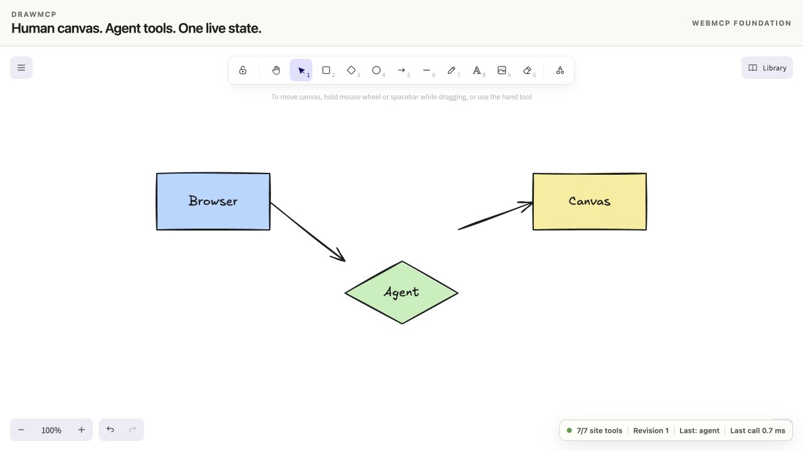

# DrawMCP core WebMCP proof

Core semantics were verified on 2026-09-01 against commit `85be8d4`.
The routed showcase and custom-domain release were verified against merge
commit `1debe6d`.

## Current launch

- Production domain: `https://drawmcp.dev`
- Tool-owning route: `https://drawmcp.dev/canvas`
- Documentation: `https://drawmcp.dev/docs`
- Benchmark room: `https://drawmcp.dev/benchmarks`
- Verified production deployment: `dpl_8oxBJAADh93E3QPkQX4vjKTakzUM`
- Deployment state: `READY`
- Domain state: ownership verified, correctly configured, edge network active
- Custom-domain Chrome Labs smoke: 11/11 steps across all seven cases
- Custom-domain ChatGPT discovery: 7/7 tools and successful summary call
- Main-branch GitHub CI: passed in 38 seconds

The Vercel preview deployment was accessible in the signed-in in-app browser
but not to the unauthenticated Chrome runner, behavior consistent with preview
access protection. The public production alias and custom domain both passed
the same evaluator, so the preview access settings were left unchanged.

## Deployed artifact

- Vercel project: `moizibnyousafs-projects/excalidraw-webmcp`
- Deployment ID: `dpl_C6yJAMfoHxLzKVWZx2K4XpnExkYn`
- Deployment URL:
  `https://excalidraw-webmcp-4zl69ewn9-moizibnyousafs-projects.vercel.app`
- Stable Vercel alias: `https://excalidraw-webmcp-nine.vercel.app`
- Vercel state: `READY`
- Target: `production` because Vercel automatically assigns a new project's
  first deployment to that target
- Custom domain at this first core-only gate: not yet attached; the current
  launch status is recorded above

The deployment was created from a clean working tree at the commit above.

## Verification layers

| Layer | Result | What it proves |
| --- | --- | --- |
| Unit and component tests | 46/46 passed across 9 files | Schema, registry, revision, mutation, layout, metrics, and component behavior |
| Lint | Passed | Checked application and Vite source |
| TypeScript and Vite build | Passed | Production bundle compiles and renders |
| Generated eval contract | Passed | `evals/tools.json` matches the production tool definitions |
| Local Chrome Labs smoke | 11/11 steps across 7 cases | Every top-level tool executes against a live local page |
| Deployed Chrome Labs smoke | 11/11 steps across 7 cases | Every top-level tool executes against the exact Vercel alias |
| ChatGPT in-app-browser discovery | 7/7 tools | The deployed page is discoverable by the target WebMCP host |
| Deployed mutation journey | Passed | The in-app browser created and focused a visible Browser → Agent → Canvas diagram |
| Human/agent history journey | Passed | A human shape survived agent edit, Undo, and Redo as one shared Excalidraw history |
| Stale-write guard | Passed | A write against revision 6 was rejected after the page reached revision 8 |

## Live tool inventory

1. `get_canvas_summary`
2. `get_selection`
3. `add_elements`
4. `update_elements`
5. `delete_elements`
6. `fit_to_content`
7. `organize_diagram`

## Human → agent → Undo → Redo receipt

1. A human drew and selected a rectangle at x=330.
2. `get_selection` returned the same live element at revision 5.
3. `update_elements` moved it to x=580 and changed its fill, producing
   revision 6.
4. The normal Excalidraw Undo control restored the same element at x=330 with
   its original fill, producing revision 7.
5. Redo restored x=580 and the agent-selected fill, producing revision 8.
6. A subsequent mutation using `expected_revision: 6` returned
   `STALE_REVISION` with `current_revision: 8` and did not modify the canvas.

This journey exposed and then verified the fix that routes agent updates
through Excalidraw's public `newElementWith()` primitive so `version`,
`versionNonce`, and `updated` participate in native history.

## Deployed visual receipt

The status pill in the receipt shows 7/7 site tools, revision 1, the agent as
the last actor, and 0.7 ms for the most recent page-local tool execution.

## Measurement boundary

The status pill measures page-local tool execution only. It does not include
model reasoning, network transport, host scheduling, or UI stabilization.
DrawMCP does not claim an overall speed advantage until the same-task protocol
in `evals/BENCHMARK.md` has measured both the official MCP and WebMCP lanes
under the same run conditions.
